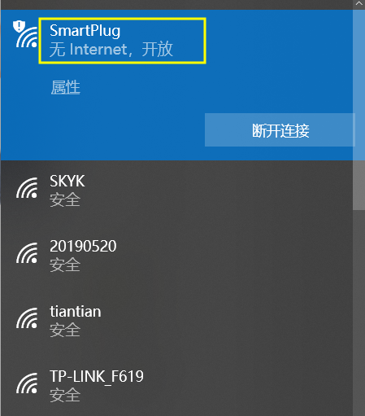
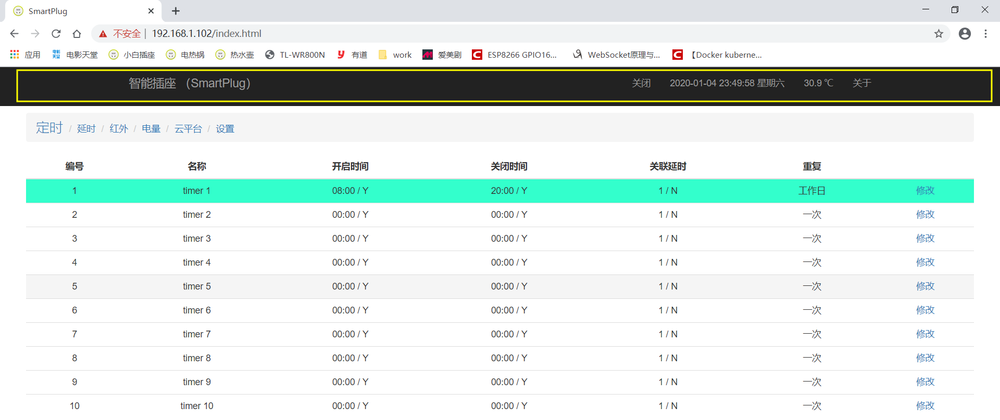
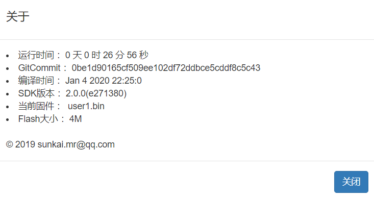
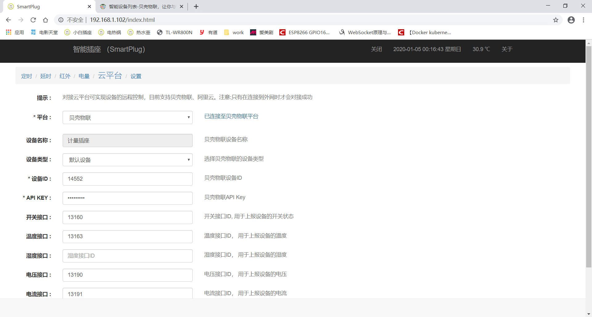

esp6266内置web烧录使用指南
==========================

2020/1/5

概述
====

声明
----

1.  该固件由本人投入了大量的时间和精力进行开发和调试，仅供esp8266爱好者一起学习和交流，严禁进行商业和非法使用，出现问题概不负责。

2.  该固件开发和测试平台为esp8266，Flash大小为4M。esp8266的SDK固件版本为2.0。在以下浏览器测试通过，Chrome 70.0.3538.102（正式版本）、Internet
    Explorer 11、Firefox 66.0.5 (32 位)。

3.  源码采用C语言编写，可在此基础上对功能进行修改和扩展。

支持的硬件
----------

1.  可使用ESP8266机智云开发板。

    

2.  ESP-12F模块自行搭建。

固件功能
--------

提供的固件有以下功能：

1.  可设置10个定时、延时任务、红外遥控、电量监控等功能。

2.  可进行系统设置。可设置设备名称（默认为SmartPlug）、esp8266的工作模式、支持OTA进行固件升级、控制设备重启、控制设备恢复出厂设置。

3.  可通过web页面控制esp8266设备。

4.  前后台通过标准的json格式数据进行交互。

5.  支持自定义网页烧录，可自定义功能进行二次开发。

6.  前后台数据隔离，网页数据烧录在Flash中（文件总的大小不能超过2M）。固件和网页可单独升级。

7.  支持AP和station模式，station模式下支持smartconfig进行wifi连接。

8.  对接云平台后支持天猫精灵控制

包含的文件
----------

| 文件                               | 说明                |
|------------------------------------|---------------------|
| ./工具/FLASH_DOWNLOAD_TOOLS_V3.6.4 | Esp8266固件烧录工具 |
| ./工具/netassist                   | 网络调试助手        |
| ./工具/sscom                       | 串口调试助手        |
| ./工具/WinGZip V1.0.exe            | Gzip压缩工具        |
| ./烧录固件/固件                    | 待烧录的固件        |
| ./烧录固件/html                    | 待烧录的html页面    |
| ./文档                             | 常用的的文档        |

烧录固件
--------

1.  打开烧录工具（工具\\FLASH_DOWNLOAD_TOOLS_V3.6.4\\ESPFlashDownloadTool_v3.6.4.exe）.

2.  按下图选择好固件以及对应的烧录地址点击“START”完成固件烧录。（首次烧录时先点击“ERASE”擦除全部FLASH再进行烧录）

    

烧录网页数据
------------

1.  打开串口助手（./工具/sscom）并连接好esp8266。然后给esp8266重新上电。按下按键3s-6s等待esp8266蓝色指示灯常快速闪烁时松开按键。esp8266将重启启动并进入ap模式。

2.  待esp8266重启完成串口助手有如上信息输出“set wifi mode AP
    successed”表示已已进入AP模式。

3.  电脑连接esp8266发射的wifi信号，默认wifi名称为“SmartPlug”。

    

4.  打开浏览器在地址栏输入“192.168.4.1”进入esp8266的配置页面。

5.  点击网页升级中的“选择文件”，然后选择“esp6266固件\\烧录固件\\html\\release”中的压缩过的网页数据。

    

6.  重复上一步骤将“esp6266固件\\烧录固件\\html\\release”中的文件全部选择好后点击“上传”开始烧录网页数据。如下图为上传完成后的示意图。

    

7.  烧录完页面后，在浏览器在地址栏重新输入“192.168.4.1”即可进入esp8266的主页面。

    

配置esp8266连接wifi
-------------------

将esp8266配置为station模式并连接wifi接入互联网

1.  在上一步骤的基础上选择“设置”标签，进入开始配置esp8266。

    

2.  按下图，将模式设置为“客户端”、并填写好要连接的wifi名称和密码。点击“确定”。然后点击“重启”使新配置生效。

    

    

3.  esp8266重启完成时串口有如下信息输出。可看到wifi已设置为station模式，esp8266分配的ip为192.168.1.102。

    

4.  同一wifi下在浏览器输入“192.168.1.102”即可进入esp8266首页。

    

另外一种方法配置esp8266连接wifi
-------------------------------

通过smartconfig方式配置esp8266连接wifi。

1.  按下按键6s以上等待esp8266蓝色指示灯常亮时松开按键。esp8266将重启启动并进入station模式，开始smartconfig配置。串口有如下信息输出。

    

2.  让手机连接wifi，并使用手机微信搜索“安信可科技”公众号，进入公众号后点击“WIFI配置”-\>”开始配置”。输入wifi的密码点击“连接”。等待蓝色指示灯停止闪烁变为常亮，esp8266配网成功。

3.  串口打印出以下信息esp8266已接入wifi。IP为192.168.0.102

    

使用指南
--------

以station模式为例，ap模式下需要连接esp8266发出的wifi并且IP使用192.168.4.1

1.  **页眉介绍**

1.  “SmartPlug”为设备名称可以在“设置”-\>“名称”中自定义。在AP模式下该名称即为esp8266发出的wifi名称；在station模式下该名称即为设备名称。

2.  “开启”或者“关闭”按钮可控制esp8266绿色指示灯的状态。该按钮状态和绿色指示灯的状态保持同步，每分钟会获取一次esp8266开关状态。

3.  “2020-01-04 23:26:33
    星期六”esp8266的时间。esp8266在station模式下启动时会通过sntp协议从互联网获取最新时间；在ap模式下由于esp8266无法联网所以该时间需要通过浏览器访问esp8266自动将浏览器的当前时间同步给esp8266。

4.  “关于”显示esp8266的运行时间、固件版本、编译时间等信息。

    

5.  **定时设置**

    点击“定时”--\>“修改”可修改对应的定时任务。

    “名称”：定时任务的名称，选择“对勾”才会启用该定时器

    “开启时间”：在该时间点会打开继电器（即绿色指示灯亮），选择“对勾”才会在该时间点开启继电器。

    “关闭时间”：在该时间点会关闭继电器（即绿色指示灯灭）。选择“对勾”才会在该时间点关闭继电器。

    “关联延时”:该定时任务执行完成后会自动启动关联的延时任务。

    “重复”：若周一到周日都没选择则该任务只执行一次。

1.  **延时设置**

    点击“延时”--\>“修改”可修改对应的延时任务。

    

    “名称”：延时任务的名称，选择“对勾”才会启用该延时。

    “开启间隔”&&“关闭间隔”继电器会开启（即绿色指示灯亮）和关闭（即绿色指示灯灭）对应的时间。

    “关联延时”:该延时任务执行完成后会自动启动关联的延时任务。

    “重复次数”：开启和关闭的循环次数，循环一次重复次数减1，减为0时延时任务停止，若有关联其他的延时则启动关联的延时。

2.  **红外控制（需要硬件支持，HS0038接入IO5）**

    点击“红外”--\>“修改”可修改对应的红外配置。

    

    “名称”：红外配置的名称，选择“对勾”才会启用该红外。

    “开启值”：点击对应右边的“重新学习”后立即将遥控器对准红外接收头按下要学习的按键。该开启值会显示为已学习的红外键值。

    “关闭值”：点击对应右边的“重新学习”后立即将遥控器对准红外接收头按下要学习的按键。该关闭值会显示为已学习的红外键值。

    学习完成后点击“确定”提交配置。此时按下遥控器对应的按键就可以控制esp8266。

3.  **电量（需要硬件支持，当HLW8032接入esp8266才会有数据）**

    点击“电量”可查看电量等计量信息。

    

    “自动刷新”：设置自动刷新时间间隔。

    “电压”：显示实时电压。单位：V

    “电流”：显示实时电流。单位：A

    “功率”：显示实时有效功率。单位：W

    “实在功率”：显示实在功率，电压\*电流所得数据，感性负载时实在功率会大于有效功率。单位：W

    “功率因数”：有效功率除以实在功率所得。

    “电量”：实时用电量。单位：Wh

    “运行时间”：esp8266累计的运行时间，此处的运行时间和菜单栏“关于”中的“运行时间”不同esp8266正常重启时该时间不清零，而菜单栏里的运行时间重启时会清零。单位：小时

    “清零数据”：电量和运行时间数据会清零。

    “欠压保护”：勾选右边的“对勾”时电压小于该设定电压插座会关闭。单位：V

    “过压保护”：勾选右边的“对勾”时电压大于该设定电压插座会关闭。单位：V

    “过流保护”：勾选右边的“对勾”时电流大于该设定电流插座会关闭。单位：A

    “过载保护”：勾选右边的“对勾”时功率大于该设定功率插座会关闭。单位：W

    “充电保护”：勾选右边的“对勾”时检测到功率小于设定的功率时在5分钟之后将关闭设备。单位：W

4.  **云平台**

    对接云平台可实现设备的远程控制，目前支持贝壳物联、阿里云。注意:只有在station模式下连接到外网时才会对接成功。

    

    “平台”：选择要对接的平台。目前支持贝壳物联、阿里云。但是阿里云需要专用的app这里一般选择“贝壳物联”，通过对接贝壳物联后可以通过贝壳物联小程序远程控制设备，也可以使用天猫精灵控制esp8266。

    “设备名称”：无需关心 ，对接成功后该名称会从贝壳物联自动获取。

    “设备类型”：根据实际情况自定义设置

    “设备ID”：必填项。对应贝壳物联设备ID

    “API KEY”：必填项。对应贝壳物联设备的APIKEY。注意：“设备ID”和“API
    KEY”必须对应否则会连接贝壳物联会失败。

    “开关接口”：选填。贝壳物联设备对应的接口ID，填写了该接口ID
    esp8266会定时向esp8266上报开关的状态。若不填则不会上报状态。

    “温度接口”：选填。贝壳物联设备对应的接口ID，填写了该接口ID
    esp8266会定时向esp8266上报温度数据。若不填则不上报。

    “湿度接口”：选填。贝壳物联设备对应的接口ID，填写了该接口ID
    esp8266会定时向esp8266上报湿度数据。若不填则不上报。

    “电压接口”：选填。贝壳物联设备对应的接口ID，填写了该接口ID
    esp8266会定时向esp8266上报电压数据。若不填则不上报。

    “电流接口”：选填。贝壳物联设备对应的接口ID，填写了该接口ID
    esp8266会定时向esp8266上报电流数据。若不填则不上报。

    “功率接口”：选填。贝壳物联设备对应的接口ID，填写了该接口ID
    esp8266会定时向esp8266上报功率数据。若不填则不上报。

    “电量接口”：选填。贝壳物联设备对应的接口ID，填写了该接口ID
    esp8266会定时向esp8266上报电量数据。若不填则不上报。

5.  **设置**

    “名称”：在AP模式下该名称即为esp8266发出的wifi名称；在station模式下该名称即为设备名称。

    “模式”：1，客户端模式：即为station模式；2，热点模式：即为AP模式；3，智能配对：设备下次重启时会进入station模式并启动smartconfig需要使用手机重新给esp8266配网。

    “WIFI”：在客户端模式下点击扫描可设置下次重启时连接的wifi名称

    “密码”：连接wifi的密码

    “上电状态”：关闭：每次上电都关闭继电器；打开：每次上电都打开继电器；上次状态：保持上一次的状态

    “升级”：选择新固件进行在线升级

    “重启”：重启esp8266

    “重置”：恢复出厂模式。定时、延时、红外、电量的数据将全部清零，esp8266进入默认的station模式并开始smartconfig配置。

API接口说明
===========

暂无，后续补充。
