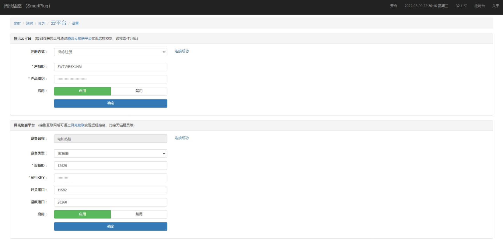
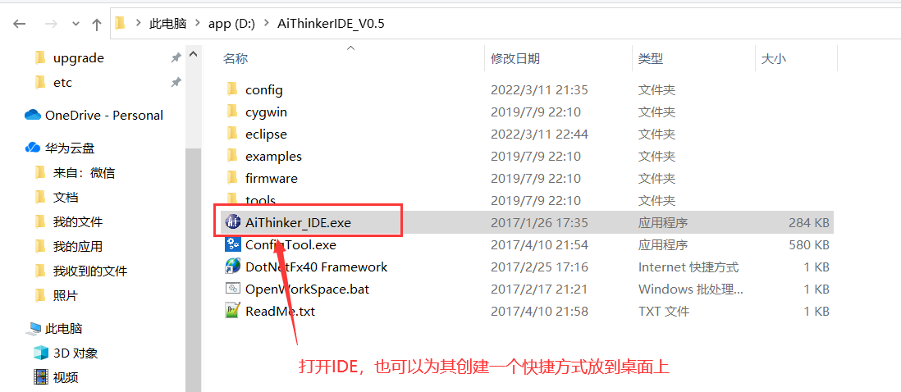
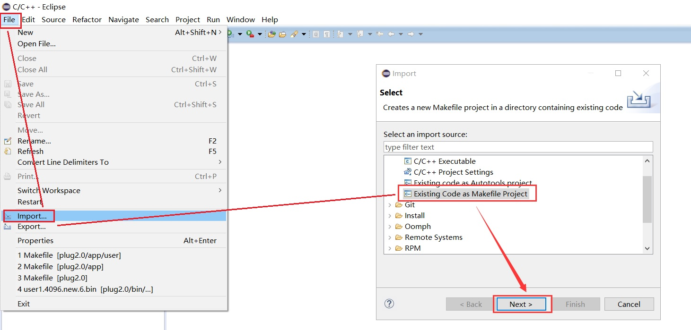
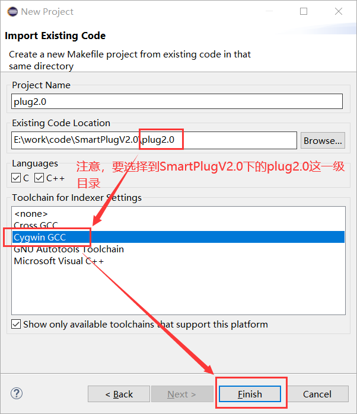
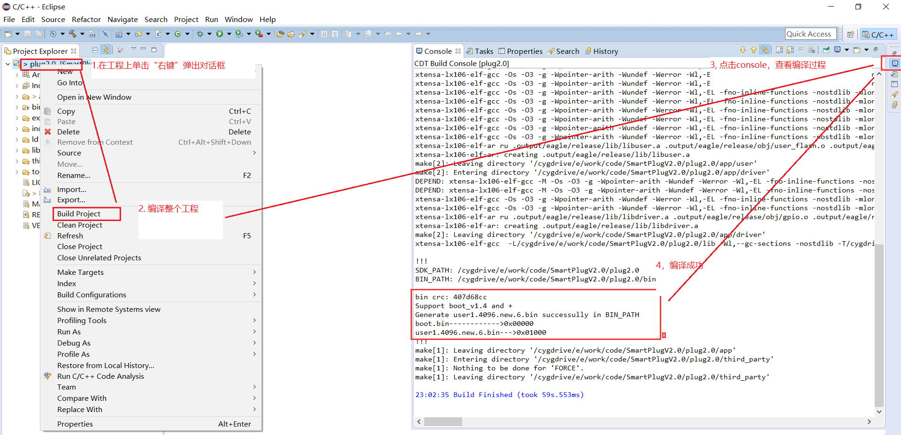
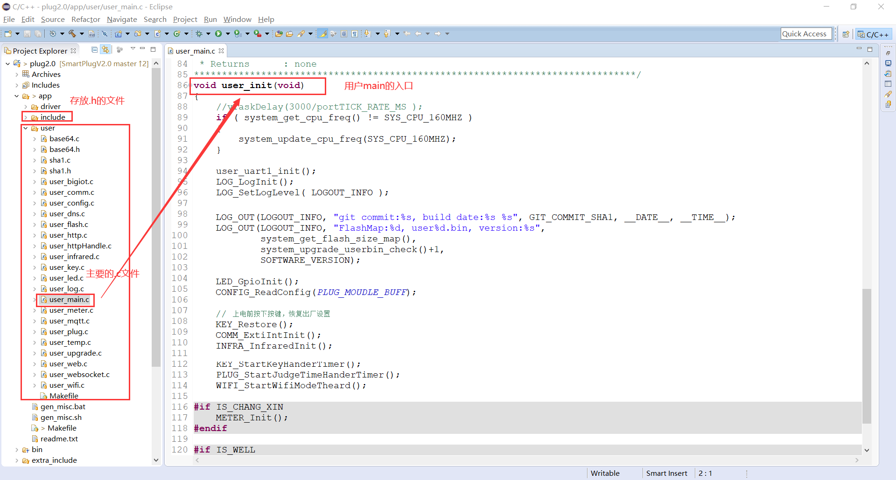

# 概述

- 该固件由本人投入了不少的时间和精力进行开发和调试，仅供esp8266爱好者一起学习和交流。

- 该固件开发和测试平台为esp8266，Flash大小为4M。esp8266的SDK固件版本为2.0。

- 源码采用C语言编写，可在此基础上对功能进行修改和扩展。

- 前端页面采用`jquery+bootstrap`编写，独立烧录。也可以自己编写前端，将页面文件烧录至flash即可。

# 支持的硬件

- 可使用ESP8266机智云开发板。


- ESP-12F模块自行搭建。如果是其他开发板只需要修改IO定义重新编译即可

# 固件功能

提供的固件有以下功能：

- 可设置10个定时、延时任务、红外遥控（需硬件支持）、电量监控（需硬件支持）等功能。

- 可进行系统设置。可设置设备名称（默认为SmartPlug）、esp8266的工作模式、支持OTA远程固件升级、控制设备重启、控制设备恢复出厂设置。

- 可通过web页面控制esp8266设备。

- 前后台通过标准的json格式数据进行交互。

- 支持自定义网页烧录，可进行二次开发。

- 前后台数据隔离，网页数据烧录在Flash中（文件总的大小不能超过2MB）。固件和网页可单独升级。

- 支持AP和station模式，station模式下支持smartconfig进行wifi配置。。

- 已对接贝壳物联、腾讯连连平台。可通过天猫精灵、微信小程序远程控制。

# 烧录与配网

## 获取固件

git仓库地址已从[旧地址]( https://github.com/linzhongpaihuai/smartplug)迁移至 [新地址]( https://github.com/sunkaimr/SmartPlugV2.0)，老仓库代码已不再维护

最新固件从这里获取： https://github.com/sunkaimr/SmartPlugV2.0/releases

固件下载后内容如下：

```bash
[root@esp8266_v5.0.1]$ tree -L 1
.
├── 工具
│   ├── FLASH_DOWNLOAD_TOOLS_V3.6.4  ==> 烧录工具
│   ├── WinGZip V1.0.exe             ==> 网页压缩工具
│   └── sscom                        ==> 串口调试助手
├── 文档                             ==> 开发参考文档
├── 烧录固件                          ==> 针对不同开发板的固件  
│   ├── changxin                     ==> 基于常新插座改装的硬件带电量计量  
│   ├── changxinV1                   ==> 基于常新插座改装的硬件不带电量计量  
│   └── jizhiyun                     ==> 基于机智云开发板的固件  
├── 烧录方法（changxinV1）.txt
├── 烧录方法（changxin）.txt
└── 烧录方法（jizhiyun）.txt          ==> 机智云开发板固件烧录步骤
```

下边的操作都是以`jizhiyun`硬件为例进行操作。接口说明：

| 接口  | 说明                                                         |
| ----- | ------------------------------------------------------------ |
| IO_13 | wifi状态指示[1:on 0:off]                                     |
| IO_15 | 继电器控制[1:on 0:off]                                       |
| IO_12 | 继电器状态指示[1:on 0:off]                                   |
| IO_4  | 按键输入[按下为低电平]。短按按键可直接控制开关，按下按键3-6s当wifi指示灯快速闪烁进入客户端模式；按键按下6s以上wifi指示灯常亮进入热点模式 |

烧录地址

| bin文件                   | 烧录地址 | 说明                                               |
| ------------------------- | -------- | -------------------------------------------------- |
| esp_init_data_default.bin | 0x3fc000 | 初始化其他射频参数，由乐鑫官方提供。只需烧写一次。 |
| blank.bin                 | 0x3fe000 | 初始化系统参数区，由乐鑫官方提供。只需烧写一次。   |
| boot_v1.6.bin             | 0x00000  | 由乐鑫官方提供。只需烧写一次。                     |
| user1.4096.new.6.bin      | 0x01000  | 用户主程序user1.bin，编译应用程序生成              |
| user1.4096.new.6.bin      | 0x101000 | 用户主程序user2.bin，编译应用程序生成              |

## 烧录

固件分为2部分，一部分是bin文件需要通过ESPFlashDownloadTool串口烧录到硬件，另外一部分是前端的页面需要通过浏览器烧录到芯片。注意根据自己的设备来烧写固件，固件和硬件不匹配会导致设备无法启动。

### 烧录固件

首先要烧录固件，步骤如下

1.  打开烧录工具（工具\\FLASH_DOWNLOAD_TOOLS_V3.6.4\\ESPFlashDownloadTool_v3.6.4.exe）.

2.  按下图选择好固件以及对应的烧录地址点击“START”完成固件烧录。（首次烧录时先点击“ERASE”擦除全部FLASH再进行烧录）

    

### 烧录网页数据


1.  打开串口助手（./工具/sscom）并连接好esp8266。然后给esp8266重新上电。 按键按下6s以上wifi指示灯常亮进入热点模式 。esp8266将重启启动并进入ap模式。

2.  待esp8266重启完成串口助手有如上信息输出“set wifi mode AP successed”表示已已进入AP模式。
    
3.  电脑连接esp8266发射的wifi信号，默认wifi名称为“SmartPlug_XXXX”。

4.  打开浏览器在地址栏输入“192.168.4.1”进入esp8266的配置页面。

5.  点击网页升级中的“选择文件”，然后选择“烧录固件\jizhiyun\html\”中的压缩过的网页数据。

    

6.  重复上一步骤将“烧录固件\jizhiyun\html”中的文件全部选择好后点击“上传”开始烧录网页数据。如下图为上传完成后的示意图。注意烧录时需要将全部文件一次性烧录进去，只要有一个失败了需要全部重新烧录。

    

7.  烧录完页面后，在浏览器在地址栏重新输入“192.168.4.1”即可进入esp8266的主页面。

    

## 配网

配网有2种方式，选择其中一种即可

- 热点模式手工配网
- smartplug方式配网

### 热点模式手工配网

烧录完成后，使esp8266处于热点模式（按键按下6s以上），电脑/手机连接esp8266的WiFi进入设置页面。

1.  选择“设置”标签，开始配置esp8266。

    

2.  按下图，将模式设置为“客户端”、并填写好要连接的wifi名称和密码。点击“确定”。然后点击“重启”使新配置生效。

    

    

3.  esp8266重启完成时串口有如下信息输出。可看到wifi已设置为station模式，esp8266分配的ip为192.168.1.102。

    

4.  同一wifi下在浏览器输入“192.168.1.102”即可进入esp8266首页。

    

### SmartConfig方式配网

SmartConfig是安信可提供的一种快捷配网方式，将esp8266设置为客户端模式通过手机将wifi的名称和密码广播出去esp8266通过广播得到WiFi名称和密码。

1.  按下按键3-6s当wifi指示灯快速闪烁进入客户端模式，开始smartconfig配置。串口有如下信息输出。

    

2.  让手机连接wifi（目前只支持2.4G频段，5G频段的大多物联设备都不支持），并使用手机微信搜索“安信可科技”公众号，进入公众号后点击“WIFI配置”-\>”开始配置”。输入wifi的密码点击“连接”。等待蓝色指示灯停止闪烁变为常亮，esp8266配网成功。

3.  串口打印出以下信息esp8266已接入wifi。IP为192.168.0.102

    

使用指南
========

热点模式下需要连接esp8266发出的wifi并且IP使用192.168.4.1，热点模式只能通过手机或电脑直连esp8266无法远程控制。以客户端模式为例这里以客户端模式为例说明页面的功能。

## 页眉介绍


1.  “SmartPlug”为设备名称可以在“设置”-\>“名称”中自定义。在热点模式下该名称即为esp8266发出的wifi名称；在客户端模式下该名称即为设备名称。

2.  “开启”或者“关闭”按钮可控制esp8266绿色指示灯的状态（开关指示灯）。该按钮状态和绿色指示灯的状态保持同步，每分钟会获取一次esp8266开关状态。

3.  “2020-01-04 23:26:33 星期六”esp8266的时间。esp8266在客户端模式下启动时会通过sntp协议从互联网获取最新时间；在热点模式下由于esp8266无法联网所以该时间需要通过浏览器访问esp8266页面，自动将浏览器的时间同步给esp8266。
    
4. “关于”显示esp8266的运行时间、固件版本、编译时间等信息。

5. "控制台"，点击控制台会有一个新的网页弹出，该网页通过websocket协议与esp8266保持长链接，可以通过部分命令来和esp8266进行交互。你也可以通过修改源码来实现更多的功能。

   

## 定时设置

默认提供了10组定时可供使用。点击“定时”--\>“修改”可修改对应的定时任务。当对应的定时启用时会以绿色颜色标识。

- “名称”：定时任务的名称，选择“对勾”才会启用该定时器

- “开启时间”：在该时间点会打开继电器（即绿色指示灯亮），选择“对勾”才会在该时间点开启继电器。

- “关闭时间”：在该时间点会关闭继电器（即绿色指示灯灭）。选择“对勾”才会在该时间点关闭继电器。

- “关联延时”:该定时任务执行完成后会自动启动关联的延时任务。

- “重复”：若周一到周日都没选择则该任务只执行一次。（新加功能：智能跳过节假日，从互联网获取节假日信息只在法定节假日生效。）


## 延时设置

同样默认提供了10组延时可供使用。点击“延时”--\>“修改”可修改对应的延时任务。


- “名称”：延时任务的名称，选择“对勾”才会启用该延时。

- “开启间隔”&&“关闭间隔”继电器会开启（即绿色指示灯亮）和关闭（即绿色指示灯灭）对应的时间。

- “关联延时”:该延时任务执行完成后会自动启动关联的延时任务。

- “重复次数”：开启和关闭的循环次数，循环一次重复次数减1，减为0时延时任务停止，若有关联其他的延时则启动关联的延时。

## 红外控制

通过学习遥控器的按键码后，通过遥控器就可以控制esp8266，不过这一功能需要硬件支持（jizhiyun硬件是没有该功能），红外接收管HS0038接入IO5（可参考“文档/常新定时插座改装.pdf”原理图）。点击“红外”--\>“修改”可修改对应的红外配置。


- “名称”：红外配置的名称，选择“对勾”才会启用该红外。

- “开启值”：点击对应右边的“重新学习”后立即将遥控器对准红外接收头按下要学习的按键。该开启值会显示为已学习的红外键值。

- “关闭值”：点击对应右边的“重新学习”后立即将遥控器对准红外接收头按下要学习的按键。该关闭值会显示为已学习的红外键值。

学习完成后点击“确定”提交配置。此时再按下遥控器对应的按键就可以控制esp8266。如果开启值和关闭值相同那么开和关会轮流执行。

## 电量计量

通过电量计量可以实时看到该插座的电压、电流、功率等信息，并且可以设置过压过流保护等功能。该功能需要硬件支持使用HLW8032接入esp8266才会有数据（可参考“文档/常新定时插座改装(带电量统计功能).pdf”原理图）。点击“电量”可查看电量等计量信息。


- “自动刷新”：设置自动刷新时间间隔。

- “电压”：显示实时电压。单位：V

- “电流”：显示实时电流。单位：A

- “功率”：显示实时有效功率。单位：W

- “实在功率”：显示实在功率，电压\*电流所得数据，感性负载时实在功率会大于有效功率。单位：W

- “功率因数”：有效功率除以实在功率所得。

- “电量”：实时用电量。单位：Wh

- “运行时间”：esp8266累计的运行时间，此处的运行时间和菜单栏“关于”中的“运行时间”不同esp8266正常重启时该时间不清零，而菜单栏里的运行时间重启时会清零。单位：小时

- “清零数据”：电量和运行时间数据会清零。

- “欠压保护”：勾选右边的“对勾”时电压小于该设定电压插座会关闭。单位：V

- “过压保护”：勾选右边的“对勾”时电压大于该设定电压插座会关闭。单位：V

- “过流保护”：勾选右边的“对勾”时电流大于该设定电流插座会关闭。单位：A

- “过载保护”：勾选右边的“对勾”时功率大于该设定功率插座会关闭。单位：W

- “充电保护”：勾选右边的“对勾”时检测到功率小于设定的功率时在5分钟之后将关闭设备。单位：W

## 云平台

对接云平台可实现设备的远程控制，目前支持贝壳物联、腾讯物联平台。注意:只有在客户端模式下连接到外网时才会对接成功。



### 腾讯云物联平台

注册至腾讯云物联平台可以实现通过“腾讯连连”小程序来远程控制以及远程固件升级等操作。腾讯云物联平台如何使用可以参考[这里](https://cloud.tencent.com/document/product/1081/41155) 

有2种注册方式，[动态注册](https://cloud.tencent.com/document/product/1081/47494)和[静态注册](https://cloud.tencent.com/document/product/1081/47497)。

- 动态注册时只需要提供产品ID和产品密钥esp8266首次启动时会将MAC地址作为设备名称注册至腾讯云物联平台。这样做的好处是不用事先在腾讯云物联平台创建设备，多个esp8266可以配置同一个产品ID和产品密钥。推荐使用动态注册。
- 静态注册需要事先在腾讯云物联平台创建好设备，然后将 产品ID、设备ID、设备密钥配置到esp8266中。

如果esp8266已经完成配网此时虽然可以成功注册到腾讯云物联平台，但是设备和自己的“腾讯连连”小程序无法完成关联。如果想要关联起来可以登录腾讯云物联平台在“设备调试”找到对应的设备，然后用“腾讯连连”小程序扫描设备的二维码完成绑定，绑定后就可以在“腾讯连连”小程序中控制该设备。不过这种方式太麻烦。

还有另外一种方式可以自动完成绑定，产品ID和产品密钥并保存好配置后，按下按键3-6s当wifi指示灯快速闪烁进入smartconfig配网模式，此时打开“腾讯连连”小程序 > “+号”图标 >  "添加设备" > "电工照明" > "插座" 按照提示开始配网。配网完成后在“腾讯连连”小程序中可以看到此设备。视频教程参考[这里](https://blog.csdn.net/u010177891/article/details/123456923) 

### 贝壳物联平台

需要事先在[贝壳物联平台]( https://www.bigiot.net/User/listDev.html)创建好设备和接口。如何创建设备以及将贝壳物联账号绑定到天猫精灵并可参考[这里](https://blog.csdn.net/u010177891/article/details/100058124 )

- “设备名称”：无需关心 ，对接成功后该名称会从贝壳物联平台自动获取。

- “设备类型”：根据实际情况自定义设置，这个参数意义不太。

- “设备ID”：必填项。对应贝壳物联设备ID

- “API KEY”：必填项。对应贝壳物联设备的APIKEY。注意：“设备ID”和“APIKEY”必须对应否则会连接贝壳物联会失败。

- “开关接口”：选填。贝壳物联设备对应的接口ID，填写了该接口ID esp8266会定时上报开关的状态。若不填则不会上报状态。

- “温度接口”：选填。贝壳物联设备对应的接口ID，填写了该接口IDesp8266会定时上报温度数据。若不填则不上报。

- “湿度接口”：选填。贝壳物联设备对应的接口ID，填写了该接口IDesp8266会定时上报湿度数据。若不填则不上报。

## 设置

- “名称”：在AP模式下该名称即为esp8266发出的wifi名称；在station模式下该名称即为设备名称。

- “模式”：1，客户端模式：即为station模式；2，热点模式：即为AP模式；3，智能配对：设备下次重启时会进入station模式并启动smartconfig需要使用手机重新给esp8266配网。

- “WIFI”：在客户端模式下点击扫描可设置下次重启时连接的wifi名称

- “密码”：连接wifi的密码

- “上电状态”：关闭：每次上电都关闭继电器；打开：每次上电都打开继电器；上次状态：保持上一次的状态

- “升级”：选择新固件进行在线升级

- “重启”：重启esp8266

- “重置”：恢复出厂模式。定时、延时、红外、电量的数据将全部清零，esp8266进入默认的station模式并开始smartconfig配置。云平台的配置不会清零。


# 搭建开发环境

## 安装IDE

-  安信可针对esp8266提供了一体化开发环境（基于 Windows + Cygwin + Eclipse+ GCC ），点击[这里](https://pan.baidu.com/s/12h7Tu3W4NZCjCtkhTIYNTg?pwd=j49n)下载，解压后可以直接运行无需安装。下载后直接解压到D盘根目录即可。

- 下载源码，地址：https://github.com/sunkaimr/SmartPlugV2.0.git

## 创建工程

- 打开IDE



- 在菜单栏“File” > "Import"，在弹出的对话框选择“Existing Code as Makefile Project” 然后“Next”。



- 选择之前已经clone下来的代码路径，需要注意的是路径要选择到SmartPlugV2.0\plug2.0中，否则后边编译会因为找不到Makefile而失败。



- 开始编译工程，鼠标移至项目名称上单击右键，弹出的菜单选择“Build Project”，打开“console”可以查看编译信息。



- 编译后生成最新的bin文件在`SmartPlugV2.0\plug2.0\bin\upgrade\user1.4096.new.6.bin`

# 代码

## 代码结构

```bash
├── app                        => 用户代码存放目录
│   ├── driver                 => 驱动相关，主要包括GPIO、串口的驱动
│   │   ├── gpio.c
│   │   ├── Makefile
│   │   └── uart.c
│   ├── include                => 驱动的头文件
│   │   ├── gpio.h
│   │   ├── uart.h
        ......
│   ├── Makefile
│   ├── readme.txt
│   └── user                   => 用户的业务代码
│       ├── base64.c           => 提供base64编码、解码库
│       ├── base64.h
│       ├── Makefile
│       ├── sha1.c             => sha1编码库
│       ├── sha1.h
│       ├── user_bigiot.c      => 对接贝壳物联相关代码
│       ├── user_comm.c        => 提供通用的函数
│       ├── user_config.c      => 提供配置相关的，包含从Flash中读取和写入配置，以及配置的合法性检查
│       ├── user_dns.c         => 实现了一个简单的dns服务器
│       ├── user_flash.c       => 实现了Flash读写底层函数
│       ├── user_http.c        => 解析http协议
│       ├── user_httpHandle.c  => 处理http请求
│       ├── user_infrared.c    => 解析红外编码
│       ├── user_key.c         => 按键的处理
│       ├── user_led.c         => LED灯的状态设置
│       ├── user_log.c         => 提供日志的格式化输出
│       ├── user_main.c        => 用户业务函数的入口
│       ├── user_meter.c       => 提供HLW8032电量计量相关的数据解析，以及芯片掉电前数据保存等功能
│       ├── user_mqtt.c        => 通过mqtt协议对接腾讯物联平台
│       ├── user_plug.c        => 插座相关的功能，包括定时、延时等功能
│       ├── user_temp.c        => 利用热敏电阻通过AD计算温度
│       ├── user_upgrade.c     => OTA升级相关
│       ├── user_web.c         => 提供web server的函数，http会使用 
│       ├── user_websocket.c   => 实现了简单的websocket协议
│       └── user_wifi.c        => 配置esp8266的工作模式AP、station、smartconfig等
├── bin
│   └── upgrade
│       ├── user1.4096.new.6.bin  => 每次编译生成的bin文件
├── extra_include                 => 外部的头文件
├── include                       => 头文件
├── ld
├── lib                           => 存放third_party编译后的链接库
├── LICENSE
├── Makefile
├── Makefile.bak
├── README.md  
├── third_party                   => 第三方库，直接修改无效，修改后需要重新整个编译third_party才能使用
├── tools 
└── VERSION
```

## 代码入口



# API接口

## 开关状态

### 查询开关状态

**方法：**`GET`	

**URL：** `/relaystatus`

**参数：**

无

**响应码：** 200：成功，其他：失败

**响应：**

| 字段   | 类型   | 说明                |
| ------ | ------ | ------------------- |
| status | string | on：打开；off：关闭 |

**样例：**

```bash
curl -X GET http://192.168.3.15/relaystatus
{"status":"on"}
```

### 设置开关状态

**方法：**`POST`	

**URL：** `/relaystatus`

**参数：**

| 字段   | 类型   | 说明                |
| ------ | ------ | ------------------- |
| status | string | on：打开；off：关闭 |

**响应码：**200：成功，其他：失败

**响应：**

| 字段   | 类型   | 说明                |
| ------ | ------ | ------------------- |
| status | string | on：打开；off：关闭 |

**样例：**

```bash
curl -X POST http://192.168.3.15/relaystatus -d'{"status":"off"}'
{"status":"off"}
```

## 日期

### 查询日期

**方法：**`GET`	

**URL：** `/date`

**参数：**

无

**响应码：**200：成功，其他：失败

**响应：**

| 字段     | 类型   | 说明                                      |
| -------- | ------ | ----------------------------------------- |
| Date     | string | 日期，如 “2022-03-12 12:15:13”            |
| SyncTime | bool   | true：时间已经同步成功；false：时间未同步 |

**样例：**

```bash
curl -X GET http://192.168.3.15/date
{"Date":"2022-03-12 12:18:05", "SyncTime":true}
```

### 设置日期

**方法：**`POST`	

**URL：** `/date`

**参数：**

| 字段 | 类型   | 说明                           |
| ---- | ------ | ------------------------------ |
| Date | string | 日期，如 “2022-03-12 12:15:13” |

**响应码：**200：成功，其他：失败

**响应：**

| 字段     | 类型   | 说明                                      |
| -------- | ------ | ----------------------------------------- |
| Date     | string | 日期，如 “2022-03-12 12:15:13”            |
| SyncTime | bool   | true：时间已经同步成功；false：时间未同步 |

**样例：**

```bash
curl -X POST http://192.168.3.15/date -d'{"Date":"2032-03-12 12:18:05"}'
{"Date":"2032-03-12 12:18:05", "SyncTime":true}
```

## 温度

### 查询温度

**方法：**`GET`	

**URL：** `/temperature`

**参数：**

无

**响应码：**200：成功，其他：失败

**响应：**

| 字段        | 类型  | 说明                      |
| ----------- | ----- | ------------------------- |
| Temperature | float | 温度，float类型，如：29.7 |

**样例：**

```bash
curl -X GET http://192.168.3.15/temperature
{"Temperature": 29.8}
```

## 设备信息

### 查询设备信息

**方法：**`GET`	

**URL：** `/info`

**参数：**

无

**响应码：**200：成功，其他：失败

**响应：**

| 字段            | 类型   | 说明                                       |
| --------------- | ------ | ------------------------------------------ |
| GitCommit       | string | git commit id                              |
| BuildDate       | string | 固件编译日期                               |
| SDKVersion      | string | FreeRTOS的版本                             |
| SoftWareVersion | string | 软件的版本                                 |
| FlashMap        | string | Flash的大小                                |
| UserBin         | string | 当前使用的user bin，user1.bin或者user2.bin |
| RunTime         | int    | 运行时间单位“秒”，重启会从零开始           |
| Hardware        | string | 硬件型号，在代码中自定义                   |
| Mac             | string | esp8266的mac地址                           |

**样例：**

```bash
curl -X GET http://192.168.3.15/info
{"GitCommit":"81c9939f2b33115d8305ff023f581053f2cedc3a","BuildDate":"Jun  7 2021 22:33:0","SDKVersion":"2.0.0(e271380)","SoftWareVersion":"5.0.1","FlashMap":"4MB","UserBin":"user1.bin","RunTime":3490,"Hardware":"changxin meter","Mac":"ECFABC0D6308"}
```

## 定时

### 查询指定的定时器

**方法：**`GET`	

**URL：** ` /timer/{timer_id}`

**参数：**

| 字段     | 类型 | 说明                     |
| -------- | ---- | ------------------------ |
| timer_id | int  | 定时器ID，取值范围1 ~ 10 |

**响应码：**200：成功，其他：失败

**响应：**

| 字段       | 类型   | 说明                                                         |
| ---------- | ------ | ------------------------------------------------------------ |
| Num        | int    | 定时器ID                                                     |
| Name       | string | 定时器名字                                                   |
| Enable     | bool   | 该定时器是否启用                                             |
| OnTime     | string | 开启的时间点，如：“08:00”                                    |
| OnEnable   | bool   | 开启的时间点功能是否启用                                     |
| OffTime    | string | 关闭的时间点，如：“18:00”                                    |
| OffEnable  | bool   | 关闭的时间点功能是否启用                                     |
| Week       | int    | 重复，0x00（执行一次）；0x01（每周一）；0x02（每周二）；0x04（每周三）；0x08（每周四）；0x10（每周五）；0x20（每周六）；0x40（每周日）；0x7F（每天）。以上情况可以随意组合只需对其求或运算，比如想在周一和周二执行则 “Week=(0x01\|0x02)” |
| CascodeNum | int    | 级联任务，该定时任务完成之后会启动延时任务，延时任务的ID即为CascodeNum |
| Cascode    | bool   | 级联任务是否打开                                             |

**样例：**

```bash
curl -X GET http://192.168.3.15/timer/1
[{"Num":1,"Name":"timer 1","Enable":false,"OnEnable":true,"OffEnable":true,"Cascode":false,"Week":31,"CascodeNum":1,"OnTime":"18:30","OffTime":"03:00"}]
```

### 设置指定的定时器

**方法：**`POST`	

**URL：** ` /timer`

**参数：**

| 字段       | 类型   | 说明                                                         |
| ---------- | ------ | ------------------------------------------------------------ |
| Num        | int    | 定时器ID                                                     |
| Name       | string | 定时器名字                                                   |
| Enable     | bool   | 该定时器是否启用                                             |
| OnTime     | string | 开启的时间点，如：“08:00”                                    |
| OnEnable   | bool   | 开启的时间点功能是否启用                                     |
| OffTime    | string | 关闭的时间点，如：“18:00”                                    |
| OffEnable  | bool   | 关闭的时间点功能是否启用                                     |
| Week       | int    | 重复，0x00（执行一次）；0x01（每周一）；0x02（每周二）；0x04（每周三）；0x08（每周四）；0x10（每周五）；0x20（每周六）；0x40（每周日）；0x7F（每天）。以上情况可以随意组合只需对其求或运算，比如想在周一和周二执行则 “Week=(0x01\|0x02)” |
| CascodeNum | int    | 级联任务，该定时任务完成之后会启动延时任务，延时任务的ID即为CascodeNum |
| Cascode    | bool   | 级联任务是否打开                                             |

**响应码：**200：成功，其他：失败

**响应：**

| 字段   | 类型   | 说明                              |
| ------ | ------ | --------------------------------- |
| result | string | 结果。success：成功，失败：failed |
| msg    | string | 返回信息                          |

**样例：**

```bash
curl -X POST http://192.168.3.15/timer -d'[{"Num":1,"Name":"timer 1","Enable":true,"OnEnable":true,"OffEnable":true,"Cascode":false,"CascodeNum":1,"Week":31,"OnTime":"18:30","OffTime":"03:00"}]'
{"result":"success", "msg":""}
```

### 获取所有定时器

**方法：**`POST`	

**URL：** ` /timer/all`

**参数：**

无

**响应码：**200：成功，其他：失败

**响应：**

响应字段参考“查询指定的定时器”。

**样例：**

```bash
curl -X GET http://192.168.3.15/timer/all
[{"Num":1,"Name":"timer 1","Enable":true,"OnEnable":true,"OffEnable":true,"Cascode":false,"Week":31,"CascodeNum":1,"OnTime":"18:30","OffTime":"03:00"},{"Num":2,"Name":"timer 2","Enable":false,"OnEnable":true,"OffEnable":true,"Cascode":false,"Week":0,"CascodeNum":1,"OnTime":"00:00","OffTime":"00:00"},{"Num":3,"Name":"timer 3","Enable":false,"OnEnable":true,"OffEnable":true,"Cascode":false,"Week":0,"CascodeNum":1,"OnTime":"00:00","OffTime":"00:00"},{"Num":4,"Name":"timer 4","Enable":false,"OnEnable":true,"OffEnable":true,"Cascode":false,"Week":0,"CascodeNum":1,"OnTime":"00:00","OffTime":"00:00"},{"Num":5,"Name":"timer 5","Enable":false,"OnEnable":true,"OffEnable":true,"Cascode":false,"Week":0,"CascodeNum":1,"OnTime":"00:00","OffTime":"00:00"},{"Num":6,"Name":"timer 6","Enable":false,"OnEnable":true,"OffEnable":true,"Cascode":false,"Week":0,"CascodeNum":1,"OnTime":"00:00","OffTime":"00:00"},{"Num":7,"Name":"timer 7","Enable":false,"OnEnable":true,"OffEnable":true,"Cascode":false,"Week":0,"CascodeNum":1,"OnTime":"00:00","OffTime":"00:00"},{"Num":8,"Name":"timer 8","Enable":false,"OnEnable":true,"OffEnable":true,"Cascode":false,"Week":0,"CascodeNum":1,"OnTime":"00:00","OffTime":"00:00"},{"Num":9,"Name":"timer 9","Enable":false,"OnEnable":true,"OffEnable":true,"Cascode":false,"Week":0,"CascodeNum":1,"OnTime":"00:00","OffTime":"00:00"},{"Num":10,"Name":"timer 10","Enable":false,"OnEnable":true,"OffEnable":true,"Cascode":false,"Week":0,"CascodeNum":1,"OnTime":"00:00","OffTime":"00:00"}]
```

## 延时

### 查询指定的延时器

**方法：**`GET`	

**URL：** ` /delay/{delay_id}`

**参数：**

| 字段     | 类型 | 说明                     |
| -------- | ---- | ------------------------ |
| delay_id | int  | 延时器ID，取值范围1 ~ 10 |

**响应码：**200：成功，其他：失败

**响应：**

| 字段          | 类型   | 说明                                                         |
| ------------- | ------ | ------------------------------------------------------------ |
| Num           | int    | 延时器ID                                                     |
| Name          | string | 延时器名字                                                   |
| Enable        | bool   | 该延时器是否启用                                             |
| OnInterval    | string | 开启的时间间隔，如开启时间间隔为10分钟"00:10"                |
| OnEnable      | bool   | 开启功能是否启用                                             |
| OffInterval   | string | 关闭的时间间隔，如关闭时间间隔为1分钟"00:01"                 |
| OffEnable     | bool   | 关闭功能是否启用                                             |
| TimePoint     | string | 开启或关闭的时间点。（只读，由程序根据当前时间自动计算）     |
| SwFlag        | int    | 当前需要计算开启时间还是关闭时间，2:off,1:on,0:都不。（只读，由程序自动计算） |
| CycleTimes    | int    | 循环次数                                                     |
| TmpCycleTimes | int    | 剩余待执行的循环次数（只读，由程序自动计算）                 |
| CascodeNum    | int    | 级联任务，该延时任务完成之后会启动下一个延时任务，延时任务的ID即为CascodeNum |
| Cascode       | bool   | 级联任务是否打开                                             |

**样例：**

```bash
curl -X GET http://192.168.3.15/delay/1
[{"Num":1,"Name":"delay 1","Enable":false,"OnEnable":true,"OffEnable":true,"CycleTimes":1,"TmpCycleTimes":1,"SwFlag":0,"Cascode":false,"CascodeNum":2,"OnInterval":"00:10","OffInterval":"00:01","TimePoint":"16:51"}]
```

### 设置指定的延时器

**方法：**`POST`	

**URL：** ` /delay`

**参数：**

| 字段        | 类型   | 说明                                                         |
| ----------- | ------ | ------------------------------------------------------------ |
| Num         | int    | 延时器ID                                                     |
| Name        | string | 延时器名字                                                   |
| Enable      | bool   | 该延时器是否启用                                             |
| OnInterval  | string | 开启的时间间隔，如开启时间间隔为10分钟"00:10"                |
| OnEnable    | bool   | 开启功能是否启用                                             |
| OffInterval | string | 关闭的时间间隔，如关闭时间间隔为1分钟"00:01"                 |
| OffEnable   | bool   | 关闭功能是否启用                                             |
| CycleTimes  | int    | 循环次数                                                     |
| CascodeNum  | int    | 级联任务，该延时任务完成之后会启动下一个延时任务，延时任务的ID即为CascodeNum |
| Cascode     | bool   | 级联任务是否打开                                             |

**响应码：**200：成功，其他：失败

**响应：**

| 字段   | 类型   | 说明                              |
| ------ | ------ | --------------------------------- |
| result | string | 结果。success：成功，失败：failed |
| msg    | string | 返回信息                          |

**样例：**

```bash
curl -X POST http://192.168.3.15/delay -d'[{"Num":1,"Name":"delay 1","Enable":true,"OnEnable":true,"OffEnable":true,"Cascode":false,"CascodeNum":2,"CycleTimes":10,"OnInterval":"00:02","OffInterval":"00:01"}]'
{"result":"success", "msg":""}
```

### 获取所有延时任务

**方法：**`GET`	

**URL：** ` /delay/all`

**参数：**

无

**响应码：**200：成功，其他：失败

**响应：**

响应字段参考“查询指定的延时器”。

**样例：**

```bash
curl -X GET http://192.168.3.15/delay/all
[{"Num":1,"Name":"delay 1","Enable":true,"OnEnable":true,"OffEnable":true,"CycleTimes":10,"TmpCycleTimes":9,"SwFlag":2,"Cascode":false,"CascodeNum":2,"OnInterval":"00:02","OffInterval":"00:01","TimePoint":"13:17"},{"Num":2,"Name":"delay 2","Enable":false,"OnEnable":true,"OffEnable":true,"CycleTimes":15,"TmpCycleTimes":15,"SwFlag":2,"Cascode":false,"CascodeNum":3,"OnInterval":"00:01","OffInterval":"00:02","TimePoint":"16:41"},{"Num":3,"Name":"delay 3","Enable":false,"OnEnable":true,"OffEnable":true,"CycleTimes":1,"TmpCycleTimes":0,"SwFlag":0,"Cascode":false,"CascodeNum":4,"OnInterval":"00:01","OffInterval":"00:01","TimePoint":"00:00"},{"Num":4,"Name":"delay 4","Enable":false,"OnEnable":true,"OffEnable":true,"CycleTimes":1,"TmpCycleTimes":0,"SwFlag":0,"Cascode":false,"CascodeNum":5,"OnInterval":"00:01","OffInterval":"00:01","TimePoint":"00:00"},{"Num":5,"Name":"delay 5","Enable":false,"OnEnable":true,"OffEnable":true,"CycleTimes":1,"TmpCycleTimes":0,"SwFlag":0,"Cascode":false,"CascodeNum":6,"OnInterval":"00:01","OffInterval":"00:01","TimePoint":"00:00"},{"Num":6,"Name":"delay 6","Enable":false,"OnEnable":true,"OffEnable":true,"CycleTimes":1,"TmpCycleTimes":0,"SwFlag":0,"Cascode":false,"CascodeNum":7,"OnInterval":"00:01","OffInterval":"00:01","TimePoint":"00:00"},{"Num":7,"Name":"delay 7","Enable":false,"OnEnable":true,"OffEnable":true,"CycleTimes":1,"TmpCycleTimes":0,"SwFlag":0,"Cascode":false,"CascodeNum":8,"OnInterval":"00:01","OffInterval":"00:01","TimePoint":"00:00"},{"Num":8,"Name":"delay 8","Enable":false,"OnEnable":true,"OffEnable":true,"CycleTimes":1,"TmpCycleTimes":0,"SwFlag":0,"Cascode":false,"CascodeNum":9,"OnInterval":"00:01","OffInterval":"00:01","TimePoint":"00:00"},{"Num":9,"Name":"delay 9","Enable":false,"OnEnable":true,"OffEnable":true,"CycleTimes":1,"TmpCycleTimes":0,"SwFlag":0,"Cascode":false,"CascodeNum":10,"OnInterval":"00:01","OffInterval":"00:01","TimePoint":"00:00"},{"Num":10,"Name":"delay 10","Enable":false,"OnEnable":true,"OffEnable":true,"CycleTimes":1,"TmpCycleTimes":0,"SwFlag":0,"Cascode":false,"CascodeNum":0,"OnInterval":"00:01","OffInterval":"00:01","TimePoint":"00:00"}]
```

## 红外

说明：需要硬件支持，将`SmartPlugV2.0\plug2.0\app\include\user_led.h`中的`IS_CHANG_XIN`或`IS_CHANG_XIN_V1`设置为`1`时才支持此功能。

### 查询指定的红外任务

**方法：**`GET`	

**URL：** ` /infrared/{infrared_id}`

**参数：**

| 字段        | 类型 | 说明                       |
| ----------- | ---- | -------------------------- |
| infrared_id | int  | 红外任务ID，取值范围1 ~ 10 |

**响应码：**200：成功，其他：失败

**响应：**

| 字段     | 类型   | 说明                      |
| -------- | ------ | ------------------------- |
| Num      | int    | 红外控制器ID              |
| Name     | string | 红外控制器名字            |
| Enable   | bool   | 红外控制器是否启用        |
| OnValue  | string | 红外开启的键码："DA00000" |
| OffValue | string | 红外关闭的键码：“DA02000” |

**样例：**

```bash
curl -X GET http://192.168.3.15/infrared/1
[{"Num":1,"Name":"infrared 1","Enable":false,"OnValue":"0","OffValue":"0"}]
```

### 学习开启键码

**方法：**`GET`	

**URL：** ` /infrared/{infrared_id}/switch/on`

**参数：**

| 字段        | 类型 | 说明                       |
| ----------- | ---- | -------------------------- |
| infrared_id | int  | 红外任务ID，取值范围1 ~ 10 |

**响应码：**200：成功，其他：失败

**响应：**

| 字段  | 类型   | 说明                                                         |
| ----- | ------ | ------------------------------------------------------------ |
| Num   | int    | 红外控制器ID                                                 |
| Value | string | 学习到红外键码，如“CA80000”，注意： 需在在30s内完成学习 ，否则超时会返回0 |

*该接口并不会存储学习到的红外键码，需要再次调用“设置指定红外任务”接口来设置到设备内。*

**样例：**

```bash
curl -X GET http://192.168.3.15/infrared/1/switch/on
{"Num":1, "Value":"CA80000"}
```

### 学习关闭键码

**方法：**`GET`	

**URL：** ` /infrared/{infrared_id}/switch/off`

**参数：**

| 字段        | 类型 | 说明                       |
| ----------- | ---- | -------------------------- |
| infrared_id | int  | 红外任务ID，取值范围1 ~ 10 |

**响应码：**200：成功，其他：失败

**响应：**

| 字段  | 类型   | 说明                                                         |
| ----- | ------ | ------------------------------------------------------------ |
| Num   | int    | 红外控制器ID                                                 |
| Value | string | 学习到红外键码，如“DA00000”，注意： 需在在30s内完成学习 ，否则超时会返回0 |

*该接口并不会存储学习到的红外键码，需要再次调用“设置指定红外任务”接口来设置到设备内。*

**样例：**

```bash
curl -X GET http://192.168.3.15/infrared/1/switch/off
{"Num":1, "Value":"DA00000"}
```

### 设置指定的红外任务

**方法：**`POST`	

**URL：** ` /infrared`

**参数：**

| 字段     | 类型   | 说明                                                         |
| -------- | ------ | ------------------------------------------------------------ |
| Num      | int    | 红外控制器ID                                                 |
| Name     | string | 红外控制器名字                                               |
| Enable   | bool   | 红外控制器是否启用                                           |
| OnValue  | string | 红外开启的键码："DA02000"，该值可以通过“学习开启键码”接口来获取 |
| OffValue | string | 红外关闭的键码：“DA00000”，该值可以通过“学习关闭键码”接口来获取 |

**响应码：**200：成功，其他：失败

**响应：**

| 字段   | 类型   | 说明                              |
| ------ | ------ | --------------------------------- |
| result | string | 结果。success：成功，失败：failed |
| msg    | string | 返回信息                          |

**样例：**

```bash
curl -X POST http://192.168.3.15/infrared -d'[{"Num":1,"Name":"infrared 1","Enable":true,"OnValue":"DA00000","OffValue":"DA02000"}]'
{"result":"success", "msg":""}
```

### 获取所有红外任务

**方法：**`GET`	

**URL：** ` /infrared/all`

**参数：**

无

**响应码：**200：成功，其他：失败

**响应：**

响应字段参考“查询指定的红外任务”。

**样例：**

```bash
curl -X GET http://192.168.3.15/infrared/all
[{"Num":1,"Name":"infrared 1","Enable":true,"OnValue":"DA00000","OffValue":"DA02000"},{"Num":2,"Name":"infrared 2","Enable":false,"OnValue":"0","OffValue":"0"},{"Num":3,"Name":"infrared 3","Enable":false,"OnValue":"0","OffValue":"0"},{"Num":4,"Name":"infrared 4","Enable":false,"OnValue":"0","OffValue":"0"},{"Num":5,"Name":"infrared 5","Enable":false,"OnValue":"0","OffValue":"0"},{"Num":6,"Name":"infrared 6","Enable":false,"OnValue":"0","OffValue":"0"},{"Num":7,"Name":"infrared 7","Enable":false,"OnValue":"0","OffValue":"0"},{"Num":8,"Name":"infrared 8","Enable":false,"OnValue":"0","OffValue":"0"},{"Num":9,"Name":"infrared 9","Enable":false,"OnValue":"0","OffValue":"0"},{"Num":10,"Name":"infrared 10","Enable":false,"OnValue":"0","OffValue":"0"}]
```

## 电量

说明：需要硬件支持，将`SmartPlugV2.0\plug2.0\app\include\user_led.h`中的`IS_CHANG_XIN`设置为`1`时才支持此功能。

### 查询电量计量

**方法：**`GET`	

**URL：** `/meter`

**参数：**

无

**响应码：**200：成功，其他：失败

**响应：**

| 字段               | 类型   | 说明                                                  |
| ------------------ | ------ | ----------------------------------------------------- |
| Voltage            | string | 电压                                                  |
| Current            | string | 电流                                                  |
| Power              | string | 功率                                                  |
| ApparentPower      | string | 视在功率                                              |
| PowerFactor        | string | 功率因数                                              |
| Electricity        | string | 电量                                                  |
| RunTime            | string | 运行时间，单位小时                                    |
| UnderVoltage       | string | 欠压保护动作电压                                      |
| UnderVoltageEnable | bool   | 是否开启欠压保护                                      |
| OverVoltage        | string | 过压保护动作电压                                      |
| OverVoltageEnable  | bool   | 是否开启过压保护                                      |
| OverCurrent        | string | 过流保护动作电流                                      |
| OverCurrentEnable  | bool   | 是否开启过流保护                                      |
| OverPower          | bool   | 过载保护动作功率                                      |
| OverPowerEnable    | bool   | 是否开启过载保护                                      |
| UnderPower         | string | 充电保护，检测到功率小于此功率时在5分钟之后将关闭设备 |
| UnderPowerEnable   | bool   | 是否开启充电保护                                      |

**样例：**

```bash
curl -X GET http://192.168.3.15/meter
{"Voltage":"234.2","Current":"0.4","Power":"45.2","ApparentPower":"98.5","PowerFactor":"0.46","Electricity":"9438.6","RunTime":"4939.2","UnderVoltage":"180","OverVoltage":"250","OverCurrent":" 10","OverPower":"2200","UnderPower":"1.0","UnderVoltageEnable":true,"OverVoltageEnable":true,"OverCurrentEnable":true,"OverPowerEnable":true,"UnderPowerEnable":false}
```

### 设置电量计量

**方法：**`GET`	

**URL：** `/meter`

**参数：**

| 字段               | 类型   | 说明                                                  |
| ------------------ | ------ | ----------------------------------------------------- |
| Electricity        | string | 电量                                                  |
| RunTime            | string | 运行时间，单位小时                                    |
| UnderVoltage       | string | 欠压保护动作电压                                      |
| UnderVoltageEnable | bool   | 是否开启欠压保护                                      |
| OverVoltage        | string | 过压保护动作电压                                      |
| OverVoltageEnable  | bool   | 是否开启过压保护                                      |
| OverCurrent        | string | 过流保护动作电流                                      |
| OverCurrentEnable  | bool   | 是否开启过流保护                                      |
| OverPower          | bool   | 过载保护动作功率                                      |
| OverPowerEnable    | bool   | 是否开启过载保护                                      |
| UnderPower         | string | 充电保护，检测到功率小于此功率时在5分钟之后将关闭设备 |
| UnderPowerEnable   | bool   | 是否开启充电保护                                      |

**响应码：**200：成功，其他：失败

**响应：**

响应字段参考“查询电量计量”。

**样例：**

```bash
# 清零电量和运行时间
curl -X POST http://192.168.3.15/meter -d'{"Electricity":"0","RunTime":"0"}'
{"Voltage":"233.7","Current":"0.4","Power":"42.0","ApparentPower":"91.5","PowerFactor":"0.46","Electricity":"0.0","RunTime":"0.0","UnderVoltage":"180","OverVoltage":"250","OverCurrent":" 10","OverPower":"2200","UnderPower":"1.0","UnderVoltageEnable":true,"OverVoltageEnable":true,"OverCurrentEnable":true,"OverPowerEnable":true,"UnderPowerEnable":false}

# 设置过流保护的电流
curl -X POST http://192.168.3.15/meter -d'{"OverCurrent":"1","OverCurrentEnable": true}'
{"Voltage":"233.1","Current":"0.4","Power":"38.5","ApparentPower":"82.1","PowerFactor":"0.47","Electricity":"1.7","RunTime":"0.1","UnderVoltage":"180","OverVoltage":"250","OverCurrent":"  1","OverPower":"2200","UnderPower":"1.0","UnderVoltageEnable":true,"OverVoltageEnable":true,"OverCurrentEnable":true,"OverPowerEnable":true,"UnderPowerEnable":false}
```

## 云平台

### 查询云平台信息

**方法：**`GET`	

**URL：** `/cloudplatform`

**参数：**

无

**响应码：**200：成功，其他：失败

**响应：**

根据平台可分为2类，一类是和腾讯物联平台相关的，一类是和贝壳物联相关的。

| 字段              | 类型   | 说明                                                         |
| ----------------- | ------ | ------------------------------------------------------------ |
| TencentEnable     | bool   | 【必选】是否连接至腾讯云物联平台                             |
| MqttRegisteType   | int    | 【必选】设备的注册类型有2类，动态注册：0；静态注册：1；动态注册需要提供MqttProductKey，MqttProductSecret。静态注册需要提供MqttProductKey，MqttDevName，MqttDevSecret。 |
| MqttProductKey    | string | 【必选】产品ID                                               |
| MqttProductSecret | string | 【动态注册时必选】产品密钥                                   |
| MqttDevName       | string | 【静态注册时必选】设备ID                                     |
| MqttDevSecret     | string | 【静态注册时必选】设备密钥                                   |
| TencontConnectSta | string | 设备与腾讯云物联平台的连接状态。connectting：正在连接；connected：已连接；failed：连接失败，可能是网络原因或者密钥有误；unknown：未知状态：TencentEnable为false时。 |

| 字段             | 类型   | 说明                                                         |
| ---------------- | ------ | ------------------------------------------------------------ |
| BigiotEnable     | bool   | 是否连接至贝壳物联平台                                       |
| DevType          | int    | 0:默认设备;1:电视;2:灯;3:空调;4:空气净化器;5:插座;6:开关;7:扫地机器人;8:窗帘;9:加湿器;10:风扇;11:暖奶器;12:豆浆机;13:电热水壶;14:饮水机;15:摄像头;16:路由器;17:电饭煲;18:热水器;19:烤箱;20:净水器;21:冰箱;22:机顶盒;23:传感器;24:洗衣机;25:智能床;26:香薰机;27:窗;28:抽油烟机;29:指纹锁;30:万能遥控器;31:洗碗机;32:除湿机;33:干衣机;34:壁挂炉;35:微波炉;36:取暖器;37:驱蚊器;38:跑步机;39:智能门控(门锁);40:智能手环;41:晾衣架; |
| BigiotDevId      | string | 设备ID                                                       |
| BigiotApiKey     | string | 设备的ApiKey                                                 |
| SwitchId         | string | 开关接口ID                                                   |
| TempId           | string | 温度接口ID                                                   |
| HumidityId       | string | 湿度接口ID                                                   |
| VoltageId        | string | 电压接口ID                                                   |
| CurrentId        | string | 电流接口ID                                                   |
| PowerId          | string | 功率接口ID                                                   |
| ElectricityId    | string | 电量接口ID                                                   |
| BigiotConnectSta | string | 设备与贝壳物联平台的连接状态。connectting：正在连接；connected：已连接；failed：连接失败，可能是网络原因或者密钥有误；unknown：未知状态：TencentEnable为false时。 |

**样例：**

```bash
curl -X GET http://192.168.3.15/cloudplatform
{"TencentEnable":true,"MqttRegisteType":0,"MqttProductKey":"5KH10PRXDE","MqttProductSecret":"FvsLalMo4dCeD7XZhbQFmxtN","MqttDevName":"ECFABC0D6308","MqttDevSecret":"4DhySkKn9CZ4TDYmHCUy1g==","BigiotEnable":false,"DevType":0,"BigiotDevId":"14391","BigiotApiKey":"964db11e2","SwitchId":"12978","TempId":"12979","HumidityId":"","VoltageId":"13425","CurrentId":"13426","PowerId":"13427","ElectricityId":"13429","BigiotDevName":"","BigiotConnectSta":"unknown","TencontConnectSta":"connected"}
```

### 设置云平台信息

**方法：**`POST`	

**URL：** `/cloudplatform`

**参数：**

根据平台可分为2类，一类是和腾讯物联平台相关的，一类是和贝壳物联相关的。注意配置完参数需要**重启后才会生效**。

- 配置腾讯云物联平台信息使提供以下参数

| 字段              | 类型   | 说明                                                         |
| ----------------- | ------ | ------------------------------------------------------------ |
| TencentEnable     | bool   | 【必选】是否连接至腾讯云物联平台                             |
| MqttRegisteType   | int    | 【必选】设备的注册类型有2类，动态注册：0；静态注册：1；动态注册需要提供MqttProductKey，MqttProductSecret。静态注册需要提供MqttProductKey，MqttDevName，MqttDevSecret。 |
| MqttProductKey    | string | 【必选】产品ID                                               |
| MqttProductSecret | string | 【动态注册时必选】产品密钥                                   |
| MqttDevName       | string | 【静态注册时必选】设备ID。【动态注册时必选】且MqttDevSecret必须配置为空 |
| MqttDevSecret     | string | 【静态注册时必选】设备密钥。【动态注册时必选】且MqttDevSecret必须配置为空 |

- 配置贝壳物联平台信息使提供以下参数

| 字段          | 类型   | 说明                                                         |
| ------------- | ------ | ------------------------------------------------------------ |
| BigiotEnable  | bool   | 【必选】是否连接至贝壳物联平台                               |
| DevType       | int    | 【选填】0:默认设备;1:电视;2:灯;3:空调;4:空气净化器;5:插座;6:开关;7:扫地机器人;8:窗帘;9:加湿器;10:风扇;11:暖奶器;12:豆浆机;13:电热水壶;14:饮水机;15:摄像头;16:路由器;17:电饭煲;18:热水器;19:烤箱;20:净水器;21:冰箱;22:机顶盒;23:传感器;24:洗衣机;25:智能床;26:香薰机;27:窗;28:抽油烟机;29:指纹锁;30:万能遥控器;31:洗碗机;32:除湿机;33:干衣机;34:壁挂炉;35:微波炉;36:取暖器;37:驱蚊器;38:跑步机;39:智能门控(门锁);40:智能手环;41:晾衣架; |
| BigiotDevId   | string | 【必选】设备ID                                               |
| BigiotApiKey  | string | 【必选】设备的ApiKey                                         |
| SwitchId      | string | 【选填】开关接口ID，如需查看和控制开关状态则需提供           |
| TempId        | string | 【选填】温度接口ID，如需查看温度则需提供                     |
| HumidityId    | string | 【选填】湿度接口ID，目前没有采集湿度数据                     |
| VoltageId     | string | 【选填】电压接口ID，如需查看电压数据则需提供且需硬件支持     |
| CurrentId     | string | 【选填】电流接口ID，如需查看电流数据则需提供且需硬件支持     |
| PowerId       | string | 【选填】功率接口ID，如需查看功率数据则需提供且需硬件支持     |
| ElectricityId | string | 【选填】电量接口ID，如需查看电量数据则需提供且需硬件支持     |

**响应码：**200：成功，其他：失败

**响应：**

| 字段   | 类型   | 说明                              |
| ------ | ------ | --------------------------------- |
| result | string | 结果。success：成功，失败：failed |
| msg    | string | 返回信息                          |

**样例：**

```bash
## 以下的配置虽然返回成功，但是重启后才会生效！！！

# 动态注册至腾讯物联平台
curl -X POST http://192.168.3.15/cloudplatform -d'{"TencentEnable":true,"MqttRegistType":0,"MqttProductKey":"5KH10PABCD","MqttProductSecret":"FvsLalMo4dCeD7XZABCD","MqttDevName":"","MqttDevSecret":""}'
{"result":"success", "msg":""}

# 静态注册至腾讯物联平台
curl -X POST http://192.168.3.15/cloudplatform -d'{"TencentEnable":true,"MqttRegistType":1,"MqttProductKey":"5KH10PABCD","MqttDevName":"ECFABC0D6308","MqttDevSecret":"4DhySkKn9CZ4TDYmHCabcd=="}'
{"result":"success", "msg":""}

# 配置连接至贝壳物联
curl -X POST http://192.168.3.15/cloudplatform -d'{"BigiotEnable":true,"DevType":0,"BigiotDevId":"14391","BigiotApiKey":"964dbabcd","SwitchId":"12988","TempId":"15979","VoltageId":"16425","CurrentId":"13726","PowerId":"14427","ElectricityId":"16429"}'

# 单独设置不连接腾讯物联平台
curl -X POST http://192.168.3.15/cloudplatform -d'{"TencentEnable":false}'
{"result":"success", "msg":""}

# 单独设置不连接贝壳物联平台
curl -X POST http://192.168.3.15/cloudplatform -d'{"BigiotEnable":false}'
{"result":"success", "msg":""}
```

## 系统设置

### 查询系统配置信息

**方法：**`GET`	

**URL：** `/system`

**参数：**

无

**响应码：**200：成功，其他：失败

**响应：**

| 字段            | 类型   | 说明                                                         |
| --------------- | ------ | ------------------------------------------------------------ |
| PlugName        | string | 设备名称（32个字符以内），支持中文（每个中文占3个字符）。在AP模式下该名称即为esp8266发出的wifi名称；在station模式下该名称即为设备名称。 |
| WifiMode        | int    | esp8266工作模式  1:station 2:ap 3:station_AP                 |
| SmartConfigFlag | bool   | SmartConfig是否成功。true：成功，fasle：失败。将此标志设置为false并且将WifiMode设置为station模式，重启后esp8266会自动进入SmartConfig配网模式。 |
| RelayPowerUp    | int    | 0,：上次状态，保持下电前状态，1：关闭，每次上电都关闭开关；2：打开，每次上电都打开开关； |
| WifiSSID        | string | 连接wifi的名称                                               |
| WifiPasswd      | string | 连接wifi的密码                                               |
| GetWay          | string | 网关地址，只读                                               |
| IP              | string | 分配的IIP地址，只读                                          |
| Mac             | string | esp8266的MAC地址，只读                                       |
| NetMask         | string | 掩码，只读                                                   |
| RelayStatus     | bool   | 开关的状态                                                   |

**样例：**

```bash
curl -X GET http://192.168.3.15/system
{"RelayStatus":false,"SmartConfigFlag":true,"RelayPowerUp":0,"WifiMode":1,"PlugName":"电脑","WifiSSID":"SKYK","WifiPasswd":"1234567","IP":"192.168.3.15","GetWay":"192.168.3.1","NetMask":"255.255.255.0","Mac":"ECFABC0D6308"}
```

### 设置系统信息

**方法：**`POST`	

**URL：** `/system`

**参数：**

| 字段            | 类型   | 说明                                                         |
| --------------- | ------ | ------------------------------------------------------------ |
| PlugName        | string | 设备名称（32个字符以内），支持中文（每个中文占3个字符）。在AP模式下该名称即为esp8266发出的wifi名称；在station模式下该名称即为设备名称。 |
| WifiMode        | int    | esp8266工作模式  1:station 2:ap 3:station_AP                 |
| SmartConfigFlag | bool   | SmartConfig是否成功。true：成功，fasle：失败。将此标志设置为false并且将WifiMode设置为station模式，重启后esp8266会自动进入SmartConfig配网模式。 |
| RelayPowerUp    | int    | 0,：上次状态，保持下电前状态，1：关闭，每次上电都关闭开关；2：打开，每次上电都打开开关； |
| WifiSSID        | string | 连接wifi的名称                                               |
| WifiPasswd      | string | 连接wifi的密码                                               |

**响应码：**200：成功，其他：失败

**响应：**

| 字段   | 类型   | 说明                              |
| ------ | ------ | --------------------------------- |
| result | string | 结果。success：成功，失败：failed |
| msg    | string | 返回信息                          |

**样例：**

```bash
## 以下的配置虽然返回成功，但是重启后才会生效！！！

# 配置为station模式(客户端模式)，并且设置要连接的wifi名称和密码
curl -X POST http://192.168.3.15/system -d'{"WifiMode":1,"WifiSSID":"SKYK","WifiPasswd":"1234567","SmartConfigFlag":true}'
{"result":"success", "msg":""}

# 配置为smartplug模式，重启后会进入smartpconfig配网模式
curl -X POST http://192.168.3.15/system -d'{"RelayPowerUp":0,"WifiMode":1,"SmartConfigFlag":false}'
{"result":"success", "msg":""}

# 配置为热点模式
curl -X POST http://192.168.3.15/system -d'{"RelayPowerUp":0,"WifiMode":2}'
{"result":"success", "msg":""}

# 设置设备名称
curl -X POST http://192.168.3.15/system -d'{"PlugName":"test"}'
{"result":"success", "msg":""}
```

## 重启和恢复出厂

**方法：**`POST`	

**URL：** `/control`

**参数：**

| 字段   | 类型 | 说明                                                         |
| ------ | ---- | ------------------------------------------------------------ |
| Action | int  | 0：重启设备；1：恢复出厂设置恢复出厂模式。定时、延时、红外、电量的数据将全部清零，esp8266进入默认的station模式并开始smartconfig配置。云平台的配置不会清零。 |

**响应码：**200：成功，其他：失败

**响应：**

| 字段   | 类型   | 说明                              |
| ------ | ------ | --------------------------------- |
| result | string | 结果。success：成功，失败：failed |
| msg    | string | 返回信息                          |

**样例：**

```bash
# 重启设备
curl -X POST http://192.168.3.15/system -d'{"Action":0}'
{"result":"success", "msg":""}

# 恢复出厂设置
curl -X POST http://192.168.3.15/system -d'{"Action":1}'
{"result":"success", "msg":""}
```

## 固件升级

**方法**：`PUT`	

**URL：** `/upgrade`

**参数：**

将固件以二进制方式放入http请求体内，注意不是form表单格式。

**响应码：**201：成功，其他：失败

**响应：**

| 字段   | 类型   | 说明                              |
| ------ | ------ | --------------------------------- |
| result | string | 结果。success：成功，失败：failed |
| msg    | string | 返回信息                          |

**样例：**

```bash
# 升级默认使用HTTP 1.1版本协议，其中user1.4096.new.6.bin为固件名称
curl -X PUT --data-binary @user1.4096.new.6.bin http://192.168.3.13/upgrade
{"result":"success", "msg":""}

# 如果使用上边命令升级失败，可以尝试使用HTTP1.0版本的协议，通过参数--http1.0来指定使用http1.0版本协议
curl -X PUT --http1.0 --data-binary @user1.4096.new.6.bin http://192.168.3.13/upgrade 
{"result":"success", "msg":""}
```

这里提供一个js的上传文件示例：

```js
function upgread(){
	var file=document.getElementById("binFile").files[0];
	if(file==null){
		alert("请选择固件");
		return;
	}
	xhr=new XMLHttpRequest();
	xhr.upload.onprogress=function progressFunction(evt) {
		if (evt.lengthComputable) {
			alert("进度" + Math.round(evt.loaded / evt.total * 100) + "%");
		}
	};
	xhr.open("put", "/upgrade", true);
	xhr.onreadystatechange=function () {
		if ( xhr.readyState==2 ){
			alert("正在校验");
		}else if (xhr.readyState==4) {
			if( xhr.status==201){
				alert("升级成功，设备正在重启");
			}else{
				alert("升级失败");
			}
		}
	}
	xhr.send(file);
}
```

## 网页烧写

### 获取网页烧写页面

烧写的网页是编译到代码中的，通过浏览器访问此接口可以给用户提供一个烧写复杂页面的入口。（该接口适合浏览器访问）

**方法**：`GET`	

**URL：** `/upload`

**参数：**

无

**响应码：**200：成功，其他：失败

**响应：**

返回一个html页面

**页面样例：**

```html
<!DOCTYPE html>
<html>

<head>
    <meta http-equiv="content-type" content="text/html,charset=gb2312">
    <title>升级</title>
</head>

<body>
    <table border="0" width="70%" align="center" cellpadding="6" id="tab" cellspacing="0">
        <tr>
            <th colspan="4">固件升级</th>
        </tr>
        <tr>
            <td colspan="4">
                <hr />
            </td>
        </tr>
        <tr align="left">
            <th width="40%">文件</th>
            <th width="15%">大小</th>
            <th width="20%">状态</th>
            <th width="25%"></th>
        </tr>
        <tr align="left">
            <td><input type="file" id="binFile" accept=".bin" onchange="return fileChg(this);"></td>
            <td>----</td>
            <td>----</td>
            <td><input type="button" onclick="upgread()" value="升级" /></td>
        </tr>
        <tr>
            <td colspan="4">
                <hr />
            </td>
        </tr>
        <tr>
            <td colspan="4">&nbsp;</td>
        </tr>
        <tr>
            <th colspan="4">网页升级</th>
        </tr>
        <tr>
            <td colspan="4">
                <hr />
            </td>
        </tr>
        <tr>
            <td colspan="4">
                <hr />
            </td>
        </tr>
        <tr>
            <td colspan="3"></td>
            <td>
                <input type="button" onclick="addFile()" value="添加" />
                <input type="button" onclick="uploadFile()" value="上传" />
                <input type="button" onclick="reboot()" value="重启" />
            </td>
        </tr>
    </table>
    <script type="text/javascript">
        window.onload=function() {
        addFile();
        }
        function addFile() {
        var t=document.getElementById('tab');
        var r=t.insertRow(t.rows.length-2);
        r.insertCell(0).innerHTML="<input type=\"file\" onchange=\"return fileChg(this);\">";
        r.insertCell(1).innerHTML="----";
        r.insertCell(2).innerHTML="----";
        r.insertCell(3).innerHTML="<a href=\"javascript:void(0);\" onclick=\"this.parentNode.parentNode.parentNode.removeChild(this.parentNode.parentNode)\">删除</a>";
        }
        function fileChg(obj) {
        var fz=obj.files[0].size;
        if( fz > 1024*1024 ){
        fz=(fz/1024/1024).toFixed(1) + "MB";
        }else if(fz > 1024){
        fz=(fz/1024).toFixed(1) + "KB";
        }else{
        fz=fz+"B";
        }
        var sta=obj.parentNode.parentNode.cells;
        sta[1].innerHTML=fz;
        sta[2].innerHTML="等待上传";
        }
        
        function uploadFile() {
        var files=new Array();
        var tableObj=document.getElementById("tab");
        for (var i=8; i < tableObj.rows.length-2; i++) {
        file=tableObj.rows[i].cells[0].getElementsByTagName("input")[0];
        if ( file.files[0]==null ){
        continue;
        }
        files.push(file.files[0]);
        tableObj.rows[i].cells[2].innerHTML="等待上传";
        }
        if (files.length==0){
        alert("请选择文件！");
        return;
        }
        if( sendHead(files)){
        sendFile(files, 0);
        }
        
        }
        function sendHead(fileObj) {
        var dataArr=[];
        for ( var i in fileObj ){
        var data={};
        data.Name=fileObj[i].name;
        data.Length=parseInt(fileObj[i].size);
        dataArr.push(data);
        }
        xhr=new XMLHttpRequest();
        xhr.open("post", "/html/header", false);
        xhr.send(JSON.stringify(dataArr));
        return true;
        }
        function sendFile(fileObj, index) {
        if ( index >= fileObj.length){
        alert("上传完成");
        return;
        }
        var t=document.getElementById('tab');
        xhr=new XMLHttpRequest();
        url="/html/"+fileObj[index].name
        xhr.open("put", url, true);
        xhr.upload.onprogress=function progressFunction(evt) {
        if (evt.lengthComputable) {
        t.rows[parseInt(8)+parseInt(index)].cells[2].innerHTML=Math.round(evt.loaded / evt.total * 100) + "%";
        }
        };
        t.rows[parseInt(8)+parseInt(index)].cells[2].innerHTML="%0";
        xhr.onreadystatechange=function () {
        if ( xhr.readyState==2 ){
        t.rows[parseInt(8)+parseInt(index)].cells[2].innerHTML="正在校验";
        }else if (xhr.readyState==4) {
        if( xhr.status==201){
        t.rows[parseInt(8)+parseInt(index)].cells[2].innerHTML="上传成功";
        index=index+1;
        sleep(100);
        sendFile(fileObj, index);
        }else{
        t.rows[parseInt(8)+parseInt(index)].cells[2].innerHTML="上传失败";
        }
        }
        }
        xhr.send(fileObj[index]);
        }
        function reboot(){
        xhr=new XMLHttpRequest();
        xhr.open("post", "/control", true);
        xhr.onreadystatechange=function () {
        if (xhr.readyState==4) {
        if( xhr.status==200){
        alert("设备正在重启");
        }else{
        alert("设备重启失败");
        }
        }
        }
        xhr.send("{\"Action\":0}");
        }
        function upgread(){
        var file=document.getElementById("binFile").files[0];
        if(file==null){
        alert("请选择固件");
        return;
        }
        var t=document.getElementById('tab');
        xhr=new XMLHttpRequest();
        xhr.upload.onprogress=function progressFunction(evt) {
        if (evt.lengthComputable) {
        t.rows[3].cells[2].innerHTML= Math.round(evt.loaded / evt.total * 100) + "%";
        }
        };
        xhr.open("put", "/upgrade", true);
        t.rows[3].cells[2].innerHTML="0%";
        xhr.onreadystatechange=function () {
        if ( xhr.readyState==2 ){
        t.rows[3].cells[2].innerHTML="正在校验";
        }else if (xhr.readyState==4) {
        if( xhr.status==201){
        t.rows[3].cells[2].innerHTML="上传成功";
        alert("升级成功，设备正在重启");
        }else{
        t.rows[3].cells[2].innerHTML="上传失败";
        alert("升级失败");
        }
        }
        }
        xhr.send(file);
        }
        function sleep(time) {
        var s = new Date().getTime() + parseInt(time, 10);
        while(new Date().getTime()<s) {}
        };
    </script>
</body>

</html>
```

### 烧写网页

烧写网页数据分为2步，第1步需要调用` /html/header `接口将要烧写的文件列表和每个文件的大小告诉设备，设备根据文件大小计算出来每个文件在Flash中存放地址，第2步依次调用` /html/{file}`接口逐个上传文件。如果其中某个文件上传失败或者要修改其中某个文件则需要重新依次重复1、2步。

目前最多支持10个文件，可以修改宏`HTTP_FILE_NUM_MAX`来修改最多文件大小。

- **发送文件头部信息**

**方法**：`POST`	

**URL：** `/html/header`

**参数：**

| 字段   | 类型   | 说明     |
| ------ | ------ | -------- |
| Name   | string | 文件名字 |
| Length | int    | 文件大小 |

**响应码：**200：成功，其他：失败

**响应：**

| 字段     | 类型   | 说明                                                         |
| -------- | ------ | ------------------------------------------------------------ |
| Name     | string | 文件名字                                                     |
| Length   | int    | 文件大小                                                     |
| Type     | string | 文件类型，`.html`结尾的文件在返回时会被设置为`text/html, charset=utf-8`;同样 `.js"`：`application/x-javascript`； `.css`：`text/css`；`.json`：`application/json`；`.ico`：`image/x-icon`； `.png`：`image/png`；`.gif`：`image/gif`。其他的类型在获取时会被以字节流返回`application/octet-stream` |
| Encode   | string | 文件压缩方式，目前压缩方式只支持gzip压缩                     |
| IsUpload | bool   | 文件是否已经上传                                             |
| Addr     | int    | 文件在Flash中的地址                                          |

- **查看文件头部信息**

**方法**：`GET`	

**URL：** `/html/header`

**参数：**

无

**响应码：**200：成功，其他：失败

**响应：**

参考“发送文件头部信息”返回信息

**上传文件**

**方法**：`PUT`	

**URL：** `/html/{file_name}`

**参数：**

将文件以二进制方式放入http请求体内，注意不是form表单格式。

**响应码：**201：成功，其他：失败

**响应：**

| 字段   | 类型   | 说明                              |
| ------ | ------ | --------------------------------- |
| result | string | 结果。success：成功，失败：failed |
| msg    | string | 返回信息                          |

**样例：**

```bash
# 第1步上传文件头部信息
curl -X POST http://192.168.3.13/html/header -d'[{"Name":"bootstrap.min.css.gz","Length":19604},{"Name":"bootstrap.min.js.gz","Length":9828},{"Name":"console.html.gz","Length":1952},{"Name":"favicon.ico.gz","Length":3702},{"Name":"index.html.gz","Length":5636},{"Name":"index.js.gz","Length":8700},{"Name":"jquery-1.11.1.min.js.gz","Length":33227}]'
[{"Name":"bootstrap.min.css.gz","IsUpload":false,"Addr":2129920,"Length":19604,"Type":"text/css","Encode":"gzip"},{"Name":"bootstrap.min.js.gz","IsUpload":false,"Addr":2149524,"Length":9828,"Type":"application/x-javascript","Encode":"gzip"},{"Name":"console.html.gz","IsUpload":false,"Addr":2159352,"Length":1952,"Type":"text/html, charset=utf-8","Encode":"gzip"},{"Name":"favicon.ico.gz","IsUpload":false,"Addr":2161304,"Length":3702,"Type":"image/x-icon","Encode":"gzip"},{"Name":"index.html.gz","IsUpload":false,"Addr":2165006,"Length":5636,"Type":"text/html, charset=utf-8","Encode":"gzip"},{"Name":"index.js.gz","IsUpload":false,"Addr":2170642,"Length":8700,"Type":"application/x-javascript","Encode":"gzip"},{"Name":"jquery-1.11.1.min.js.gz","IsUpload":false,"Addr":2179342,"Length":33227,"Type":"application/x-javascript","Encode":"gzip"}]

# 第2步逐个上传文件
curl -X PUT http://192.168.3.13/html/bootstrap.min.css.gz --data-binary @bootstrap.min.css.gz
{"result":"success", "msg":""}

curl -X PUT http://192.168.3.13/html/bootstrap.min.js.gz --data-binary @bootstrap.min.js.gz
{"result":"success", "msg":""}

curl -X PUT http://192.168.3.13/html/console.html.gz --data-binary @console.html.gz
{"result":"success", "msg":""}

curl -X PUT http://192.168.3.13/html/favicon.ico.gz --data-binary @favicon.ico.gz
{"result":"success", "msg":""}

curl -X PUT http://192.168.3.13/html/index.html.gz --data-binary @index.html.gz
{"result":"success", "msg":""}

curl -X PUT http://192.168.3.13/html/index.js.gz --data-binary @index.js.gz
{"result":"success", "msg":""}

curl -X PUT http://192.168.3.13/html/jquery-1.11.1.min.js.gz --data-binary @jquery-1.11.1.min.js.gz
{"result":"success", "msg":""}

# 查看上传文件头部信息，可以看到IsUpload已经是true表示文件已经上传
curl -X GET http://192.168.3.13/html/header
[{"Name":"bootstrap.min.css","IsUpload":true,"Addr":2129920,"Length":19604,"Type":"text/css","Encode":"gzip"},{"Name":"bootstrap.min.js","IsUpload":true,"Addr":2149524,"Length":9828,"Type":"application/x-javascript","Encode":"gzip"},{"Name":"console.html","IsUpload":true,"Addr":2159352,"Length":1952,"Type":"text/html, charset=utf-8","Encode":"gzip"},{"Name":"favicon.ico","IsUpload":true,"Addr":2161304,"Length":3702,"Type":"image/x-icon","Encode":"gzip"},{"Name":"index.html","IsUpload":true,"Addr":2165006,"Length":5636,"Type":"text/html, charset=utf-8","Encode":"gzip"},{"Name":"index.js","IsUpload":true,"Addr":2170642,"Length":8700,"Type":"application/x-javascript","Encode":"gzip"},{"Name":"jquery-1.11.1.min.js","IsUpload":true,"Addr":2179342,"Length":33227,"Type":"application/x-javascript","Encode":"gzip"}]
```

