# 概述

- 该固件由本人投入了不少的时间和精力进行开发和调试，仅供esp8266爱好者一起学习和交流。

- 该固件开发和测试平台为esp8266，Flash大小为4M。esp8266的SDK固件版本为2.0。

- 源码采用C语言编写，可在此基础上对功能进行修改和扩展。

- 前端页面采用jquery+bootstrap编写，独立烧录。也可以自己编写前端，将页面文件烧录至flash即可。

# 支持的硬件

- 可使用ESP8266机智云开发板。

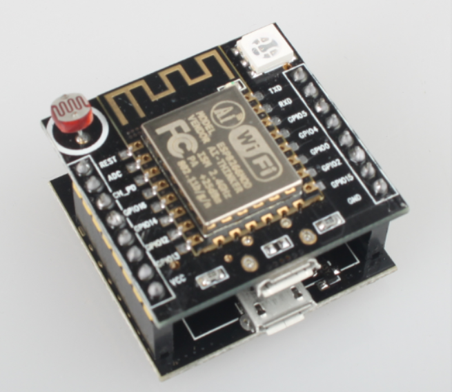

- ESP-12F模块自行搭建。如果是其他开发板只需要修改IO定义重新编译即可

# 固件功能

提供的固件有以下功能：

- 可设置10个定时、延时任务、红外遥控（需硬件支持）、电量监控（需硬件支持）等功能。

- 可进行系统设置。可设置设备名称（默认为SmartPlug）、esp8266的工作模式、支持OTA远程固件升级、控制设备重启、控制设备恢复出厂设置。

- 可通过web页面控制esp8266设备。

- 前后台通过标准的json格式数据进行交互。

- 支持自定义网页烧录，可进行二次开发。

- 前后台数据隔离，网页数据烧录在Flash中（文件总的大小不能超过2MB）。固件和网页可单独升级。

- 支持AP和station模式，station模式下支持smartconfig进行wifi配置。。

- 已对接贝壳物联、腾讯连连平台。可通过天猫精灵、微信小程序远程控制。

# 烧录与配网

## 获取固件

git仓库地址已从[旧地址]( https://github.com/linzhongpaihuai/smartplug)迁移至 [新地址]( https://github.com/sunkaimr/SmartPlugV2.0)，老仓库代码已不再维护

最新固件从这里获取： https://github.com/sunkaimr/SmartPlugV2.0/releases

固件下载后内容如下：

```bash
[root@esp8266_v5.0.1]$ tree -L 1
.
├── 工具
│   ├── FLASH_DOWNLOAD_TOOLS_V3.6.4  ==> 烧录工具
│   ├── WinGZip V1.0.exe             ==> 网页压缩工具
│   └── sscom                        ==> 串口调试助手
├── 文档                             ==> 开发参考文档
├── 烧录固件                          ==> 针对不同开发板的固件  
│   ├── changxin                     ==> 基于常新插座改装的硬件带电量计量  
│   ├── changxinV1                   ==> 基于常新插座改装的硬件不带电量计量  
│   └── jizhiyun                     ==> 基于机智云开发板的固件  
├── 烧录方法（changxinV1）.txt
├── 烧录方法（changxin）.txt
└── 烧录方法（jizhiyun）.txt          ==> 机智云开发板固件烧录步骤
```

下边的操作都是以jizhiyun硬件为例进行操作。接口说明：

| 接口  | 说明                                                         |
| ----- | ------------------------------------------------------------ |
| IO_13 | wifi状态指示[1:on 0:off]                                     |
| IO_15 | 继电器控制[1:on 0:off]                                       |
| IO_12 | 继电器状态指示[1:on 0:off]                                   |
| IO_4  | 按键输入[按下为低电平]。短按按键可直接控制开关，按下按键3-6s当wifi指示灯快速闪烁进入客户端模式；按键按下6s以上wifi指示灯常亮进入热点模式 |

烧录地址

| bin文件                   | 烧录地址 | 说明                                               |
| ------------------------- | -------- | -------------------------------------------------- |
| esp_init_data_default.bin | 0x3fc000 | 初始化其他射频参数，由乐鑫官方提供。只需烧写一次。 |
| blank.bin                 | 0x3fe000 | 初始化系统参数区，由乐鑫官方提供。只需烧写一次。   |
| boot_v1.6.bin             | 0x00000  | 由乐鑫官方提供。只需烧写一次。                     |
| user1.4096.new.6.bin      | 0x01000  | 用户主程序user1.bin，编译应用程序生成              |
| user1.4096.new.6.bin      | 0x101000 | 用户主程序user2.bin，编译应用程序生成              |

## 烧录

固件分为2部分，一部分是bin文件需要通过ESPFlashDownloadTool串口烧录到硬件，另外一部分是前端的页面需要通过浏览器烧录到芯片。

### 烧录固件

首先要烧录固件，步骤如下

1.  打开烧录工具（工具\\FLASH_DOWNLOAD_TOOLS_V3.6.4\\ESPFlashDownloadTool_v3.6.4.exe）.

2.  按下图选择好固件以及对应的烧录地址点击“START”完成固件烧录。（首次烧录时先点击“ERASE”擦除全部FLASH再进行烧录）

    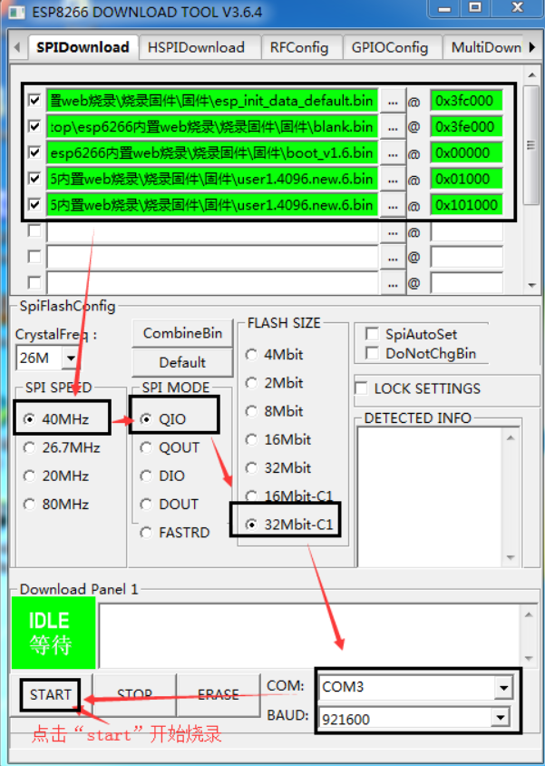

### 烧录网页数据

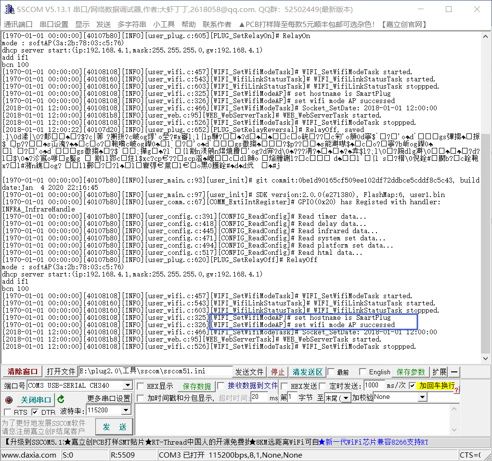

1.  打开串口助手（./工具/sscom）并连接好esp8266。然后给esp8266重新上电。 按键按下6s以上wifi指示灯常亮进入热点模式 。esp8266将重启启动并进入ap模式。

2.  待esp8266重启完成串口助手有如上信息输出“set wifi mode AP successed”表示已已进入AP模式。
    
3.  电脑连接esp8266发射的wifi信号，默认wifi名称为“SmartPlug_XXXX”。

4.  打开浏览器在地址栏输入“192.168.4.1”进入esp8266的配置页面。

5.  点击网页升级中的“选择文件”，然后选择“烧录固件\jizhiyun\html\”中的压缩过的网页数据。

    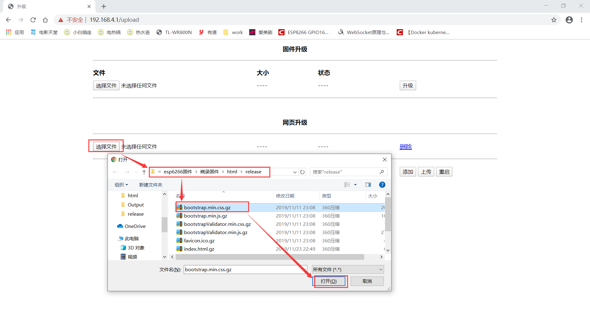

6.  重复上一步骤将“烧录固件\jizhiyun\html”中的文件全部选择好后点击“上传”开始烧录网页数据。如下图为上传完成后的示意图。注意烧录时需要将全部文件一次性烧录进去，只要有一个失败了需要全部重新烧录。

    

7.  烧录完页面后，在浏览器在地址栏重新输入“192.168.4.1”即可进入esp8266的主页面。

    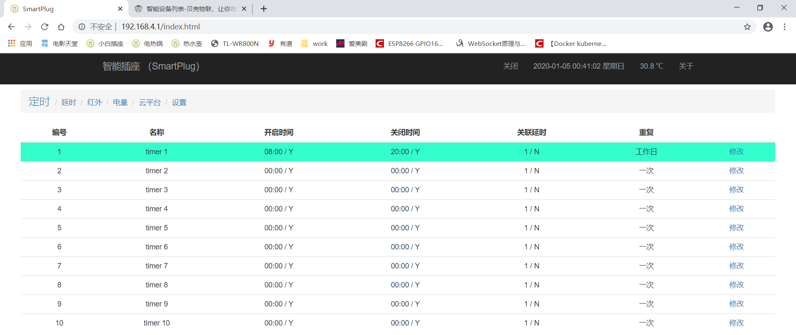

## 配网

配网有2种方式，选择其中一种即可

- 热点模式手工配网
- smartplug方式配网

### 热点模式手工配网

烧录完成后，使esp8266处于热点模式（按键按下6s以上），电脑/手机连接esp8266的WiFi进入设置页面。

1.  选择“设置”标签，开始配置esp8266。

    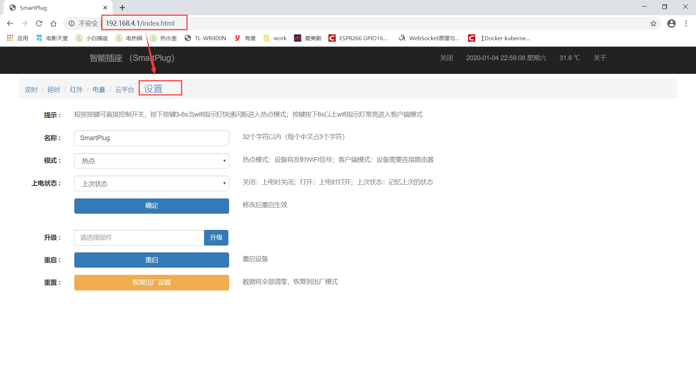

2.  按下图，将模式设置为“客户端”、并填写好要连接的wifi名称和密码。点击“确定”。然后点击“重启”使新配置生效。

    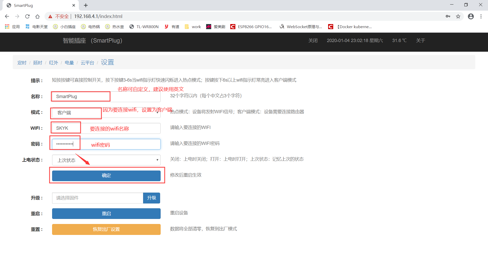

    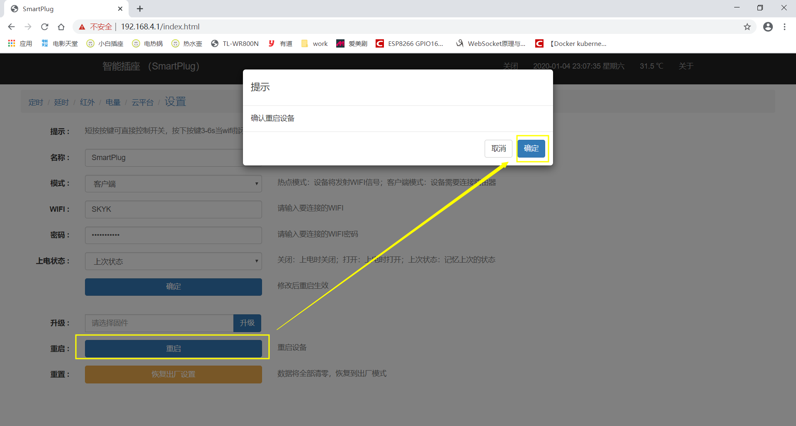

3.  esp8266重启完成时串口有如下信息输出。可看到wifi已设置为station模式，esp8266分配的ip为192.168.1.102。

    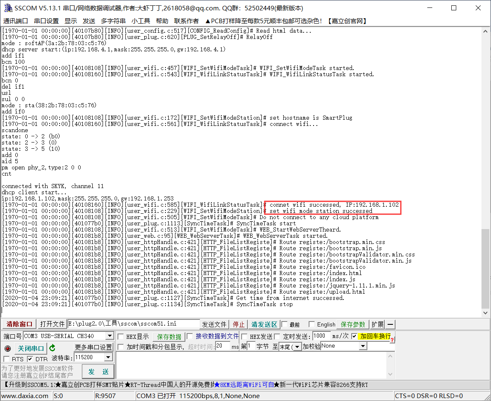

4.  同一wifi下在浏览器输入“192.168.1.102”即可进入esp8266首页。

    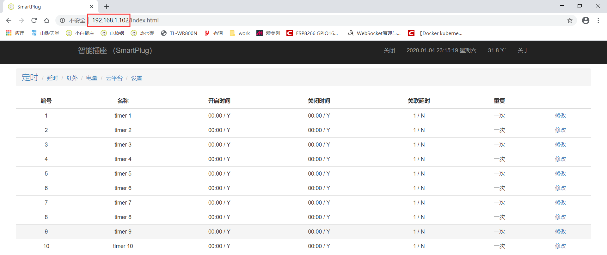

### SmartConfig方式配网

SmartConfig是安信可提供的一种快捷配网方式，将esp8266设置为客户端模式通过手机将wifi的名称和密码广播出去esp8266通过广播得到WiFi名称和密码。

1.  按下按键3-6s当wifi指示灯快速闪烁进入客户端模式，开始smartconfig配置。串口有如下信息输出。

    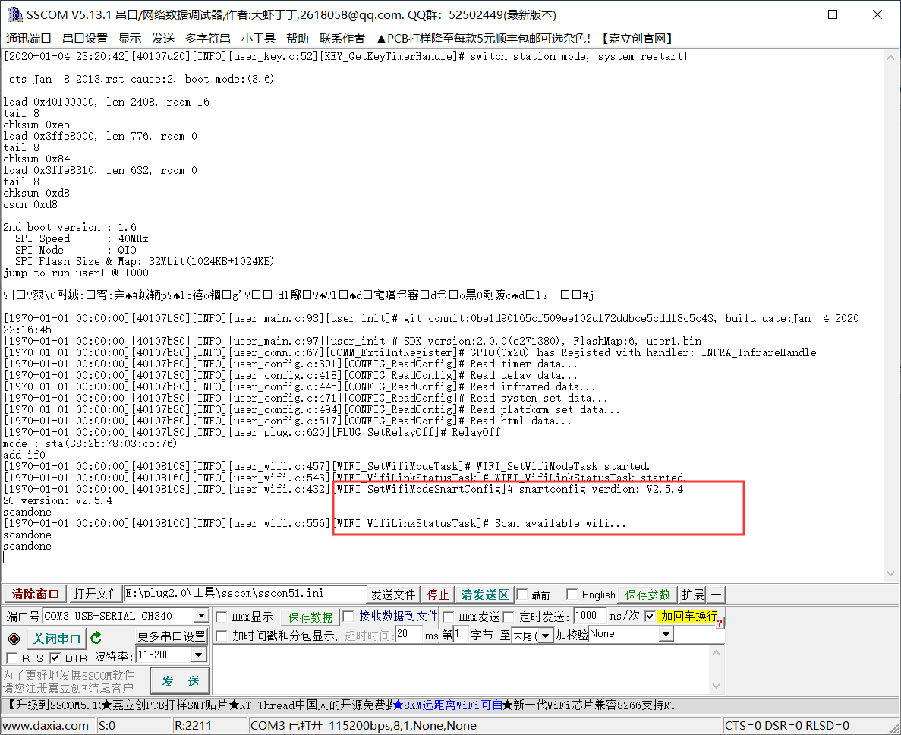

2.  让手机连接wifi（目前只支持2.4G频段，5G频段的大多物联设备都不支持），并使用手机微信搜索“安信可科技”公众号，进入公众号后点击“WIFI配置”-\>”开始配置”。输入wifi的密码点击“连接”。等待蓝色指示灯停止闪烁变为常亮，esp8266配网成功。

3.  串口打印出以下信息esp8266已接入wifi。IP为192.168.0.102

    

使用指南
========

热点模式下需要连接esp8266发出的wifi并且IP使用192.168.4.1，热点模式只能通过手机或电脑直连esp8266无法远程控制。以客户端模式为例这里以客户端模式为例说明页面的功能。

## 页眉介绍


1.  “SmartPlug”为设备名称可以在“设置”-\>“名称”中自定义。在热点模式下该名称即为esp8266发出的wifi名称；在客户端模式下该名称即为设备名称。

2.  “开启”或者“关闭”按钮可控制esp8266绿色指示灯的状态（开关指示灯）。该按钮状态和绿色指示灯的状态保持同步，每分钟会获取一次esp8266开关状态。

3.  “2020-01-04 23:26:33 星期六”esp8266的时间。esp8266在客户端模式下启动时会通过sntp协议从互联网获取最新时间；在热点模式下由于esp8266无法联网所以该时间需要通过浏览器访问esp8266页面，自动将浏览器的时间同步给esp8266。
    
4. “关于”显示esp8266的运行时间、固件版本、编译时间等信息。

5. "控制台"，点击控制台会有一个新的网页弹出，该网页通过websocket协议与esp8266保持长链接，可以通过部分命令来和esp8266进行交互。你也可以通过修改源码来实现更多的功能。

   

## 定时设置

默认提供了10组定时可供使用。点击“定时”--\>“修改”可修改对应的定时任务。当对应的定时启用时会以绿色颜色标识。

- “名称”：定时任务的名称，选择“对勾”才会启用该定时器

- “开启时间”：在该时间点会打开继电器（即绿色指示灯亮），选择“对勾”才会在该时间点开启继电器。

- “关闭时间”：在该时间点会关闭继电器（即绿色指示灯灭）。选择“对勾”才会在该时间点关闭继电器。

- “关联延时”:该定时任务执行完成后会自动启动关联的延时任务。

- “重复”：若周一到周日都没选择则该任务只执行一次。

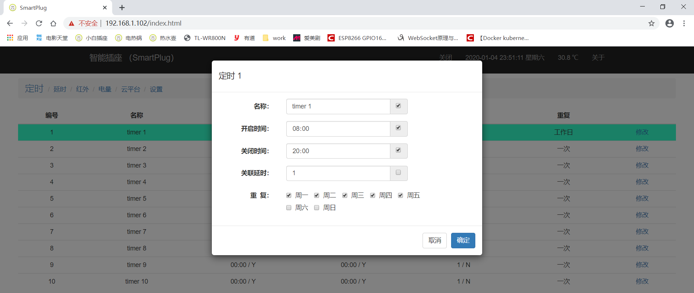

## 延时设置

同样默认提供了10组延时可供使用。点击“延时”--\>“修改”可修改对应的延时任务。

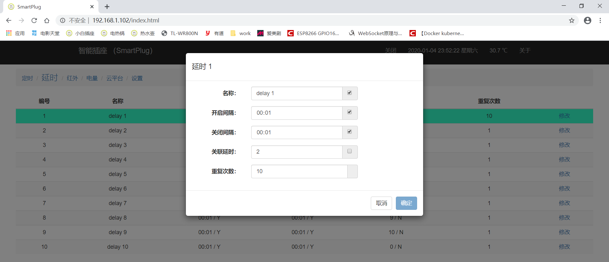

- “名称”：延时任务的名称，选择“对勾”才会启用该延时。

- “开启间隔”&&“关闭间隔”继电器会开启（即绿色指示灯亮）和关闭（即绿色指示灯灭）对应的时间。

- “关联延时”:该延时任务执行完成后会自动启动关联的延时任务。

- “重复次数”：开启和关闭的循环次数，循环一次重复次数减1，减为0时延时任务停止，若有关联其他的延时则启动关联的延时。

## 红外控制

通过学习遥控器的按键码后，通过遥控器就可以控制esp8266，不过这一功能需要硬件支持（jizhiyun硬件是没有该功能），红外接收管HS0038接入IO5（可参考“文档/常新定时插座改装.pdf”原理图）。点击“红外”--\>“修改”可修改对应的红外配置。


- “名称”：红外配置的名称，选择“对勾”才会启用该红外。

- “开启值”：点击对应右边的“重新学习”后立即将遥控器对准红外接收头按下要学习的按键。该开启值会显示为已学习的红外键值。

- “关闭值”：点击对应右边的“重新学习”后立即将遥控器对准红外接收头按下要学习的按键。该关闭值会显示为已学习的红外键值。

学习完成后点击“确定”提交配置。此时再按下遥控器对应的按键就可以控制esp8266。如果开启值和关闭值相同那么开和关会轮流执行。

## 电量计量

通过电量计量可以实时看到该插座的电压、电流、功率等信息，并且可以设置过压过流保护等功能。该功能需要硬件支持使用HLW8032接入esp8266才会有数据（可参考“文档/常新定时插座改装(带电量统计功能).pdf”原理图）。点击“电量”可查看电量等计量信息。

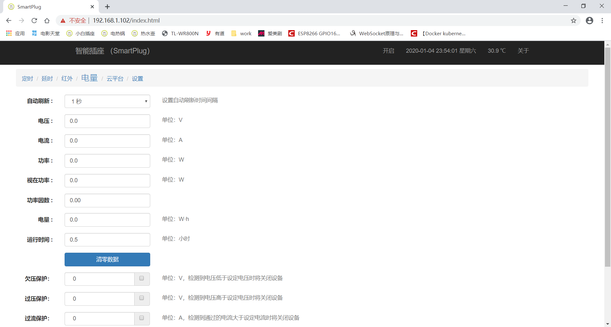

- “自动刷新”：设置自动刷新时间间隔。

- “电压”：显示实时电压。单位：V

- “电流”：显示实时电流。单位：A

- “功率”：显示实时有效功率。单位：W

- “实在功率”：显示实在功率，电压\*电流所得数据，感性负载时实在功率会大于有效功率。单位：W

- “功率因数”：有效功率除以实在功率所得。

- “电量”：实时用电量。单位：Wh

- “运行时间”：esp8266累计的运行时间，此处的运行时间和菜单栏“关于”中的“运行时间”不同esp8266正常重启时该时间不清零，而菜单栏里的运行时间重启时会清零。单位：小时

- “清零数据”：电量和运行时间数据会清零。

- “欠压保护”：勾选右边的“对勾”时电压小于该设定电压插座会关闭。单位：V

- “过压保护”：勾选右边的“对勾”时电压大于该设定电压插座会关闭。单位：V

- “过流保护”：勾选右边的“对勾”时电流大于该设定电流插座会关闭。单位：A

- “过载保护”：勾选右边的“对勾”时功率大于该设定功率插座会关闭。单位：W

- “充电保护”：勾选右边的“对勾”时检测到功率小于设定的功率时在5分钟之后将关闭设备。单位：W

## 云平台

对接云平台可实现设备的远程控制，目前支持贝壳物联、腾讯物联平台。注意:只有在客户端模式下连接到外网时才会对接成功。


### 腾讯云物联平台

注册至腾讯云物联平台可以实现通过“腾讯连连”小程序来远程控制以及远程固件升级等操作。腾讯云物联平台如何使用可以参考[这里](https://cloud.tencent.com/document/product/1081/41155) 

有2种注册方式，[动态注册](https://cloud.tencent.com/document/product/1081/47494)和[静态注册](https://cloud.tencent.com/document/product/1081/47497)。

- 动态注册时只需要提供产品ID和产品密钥esp8266首次启动时会激动将MAC地址作为设备名称注册至腾讯云物联平台。这样做的好处是不用事先在腾讯云物联平台创建设备，多个esp8266可以配置同一个产品ID和产品密钥。推荐使用动态注册。
- 静态注册需要事先在腾讯云物联平台创建好设备，然后将 产品ID、设备ID、设备密钥配置到esp8266中。

如果esp8266已经完成配网此时虽然可以成功注册到腾讯云物联平台，但是设备和自己的“腾讯连连”小程序无法完成关联。如果想要关联起来可以登录腾讯云物联平台在“设备调试”找到对应的设备，然后用“腾讯连连”小程序扫描设备的二维码完成绑定，绑定后就可以在“腾讯连连”小程序中控制该设备。不过这种方式太麻烦。

还有另外一种方式可以自动完成绑定，产品ID和产品密钥并保存好配置后，按下按键3-6s当wifi指示灯快速闪烁进入smartconfig配网模式，此时打开“腾讯连连”小程序 > “+号”图标 >  "添加设备" > "电工照明" > "插座" 按照提示开始配网。配网完成后在“腾讯连连”小程序中可以看到此设备。

### 贝壳物联平台

需要事先在[贝壳物联平台]( https://www.bigiot.net/User/listDev.html)创建好设备和接口。如何创建设备以及将贝壳物联账号绑定到天猫精灵并可参考[这里](https://blog.csdn.net/u010177891/article/details/100058124 )

- “设备名称”：无需关心 ，对接成功后该名称会从贝壳物联平台自动获取。

- “设备类型”：根据实际情况自定义设置，这个参数意义不太。

- “设备ID”：必填项。对应贝壳物联设备ID

- “API KEY”：必填项。对应贝壳物联设备的APIKEY。注意：“设备ID”和“APIKEY”必须对应否则会连接贝壳物联会失败。

- “开关接口”：选填。贝壳物联设备对应的接口ID，填写了该接口ID esp8266会定时上报开关的状态。若不填则不会上报状态。

- “温度接口”：选填。贝壳物联设备对应的接口ID，填写了该接口IDesp8266会定时上报温度数据。若不填则不上报。

- “湿度接口”：选填。贝壳物联设备对应的接口ID，填写了该接口IDesp8266会定时上报湿度数据。若不填则不上报。

## 设置

- “名称”：在AP模式下该名称即为esp8266发出的wifi名称；在station模式下该名称即为设备名称。

- “模式”：1，客户端模式：即为station模式；2，热点模式：即为AP模式；3，智能配对：设备下次重启时会进入station模式并启动smartconfig需要使用手机重新给esp8266配网。

- “WIFI”：在客户端模式下点击扫描可设置下次重启时连接的wifi名称

- “密码”：连接wifi的密码

- “上电状态”：关闭：每次上电都关闭继电器；打开：每次上电都打开继电器；上次状态：保持上一次的状态

- “升级”：选择新固件进行在线升级

- “重启”：重启esp8266

- “重置”：恢复出厂模式。定时、延时、红外、电量的数据将全部清零，esp8266进入默认的station模式并开始smartconfig配置。

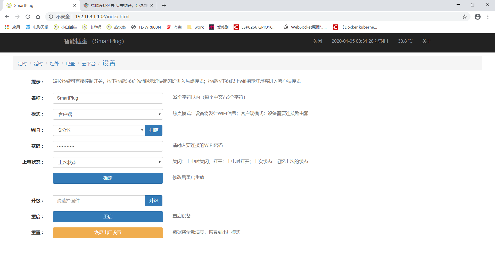

# 搭建开发环境API接口说明

暂无，后续补充。

